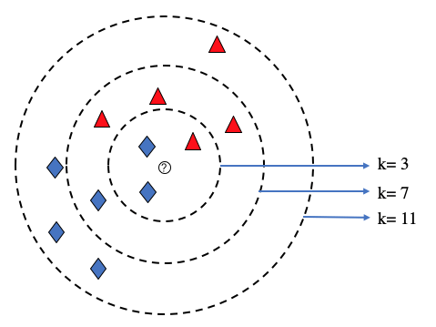

# Introduction

With the growing presence of technology in society, there is a rapidly increasing demand for hardware which supports our computational needs. One of the most important pieces of hardware for computationally-intensive workloads are Graphics Processing Units (GPUs) due to their ability to handle a multitude of parallel processing tasks; as a result, they have become an invaluable resource for companies pursuing artificial intelligence, scientific computing, cryptocurrency mining, computer graphics, or any other processing-heavy task. For example, companies on the forefront of the technology industry (such as Meta, Amazon, Apple) are a blue chip in any investor's stock portfolio; however, it is important to recognize that each of these companies depend on the ability to process vast amounts of users' data every day. Consequently, companies which manufacture processing chips have been a focal point for investors in recent years, as they directly control the output capabilities for a large portion of the technology sector.

The purpose of this project is to attempt to predict the price trends of a semiconductor manufacturer's stock — in fact, there are four stocks we wish to simultaneously predict: Nvidia, Advanced Micro Devices (AMD), Intel Corporation, and Taiwan Semiconductor Manufacturing. Though tackling four separate stocks slightly deviates from the goal of applying various of machine learning algorithms to a *single* data set, the hope is that this will give a better prediction of which machine learning models are most effective for stock market predictions (at least in the case of semiconductor manufacturers). Put differently, if we found that a particular statistical learning model was the best fit a some stock, this would naturally raise the question of whether that is due to a characteristic of the model or a characteristic of that particular stock's history. Therefore, for each of the four chip manufacturers listed above, we will apply a variety of statistical learning models, ranging from standard regression to more non-linear models like random forest and k-Nearest neighbors.

# Loading Packages and Data

```{r setup, include=TRUE, warning=FALSE, message=FALSE}
knitr::opts_chunk$set(echo = TRUE)
# Required for statistical learning algorithms
library(tidyverse)
library(tidymodels)
library(glmnet)
library(ranger) # Random forests
library(xgboost) # Extreme Gradient boosting
library(yardstick) # Model Performance

# Required for plotting
library(ggplot2)
library(corrplot)
library(plotly) # Used in several of the rotating carousels for interactive plots
library(dygraphs) # Used once in beginning for interactive plots of timeseries data

# Required for formatting:
library(kableExtra)
library(scales) 
library(swipeR) # Creates rotating carousels for images in HTML
library(htmltools) # swipeR dependencies

# Single function from entire library used:
library(vip) # vip()
library(visdat) #vis_miss() 

# ETC:
library(quantmod) #Allows dynamic loading and plotting of data


tidymodels_prefer()
conflicted::conflicts_prefer(yardstick::rsq)
conflicted::conflicts_prefer(dplyr::lag)
# Ensure that random processes return roughly same results each time
set.seed(3435)
```

One of the most useful packages in R for the analysis of stock market data is the `quantmod` package. While there are several built-in functions in the `quantmod` library which already predict stock market trends using statistical learning, we will simply use this package for the purpose of pulling live stock data from [Yahoo Finance](https://finance.yahoo.com/) and visualizing the data in a much neater fashion than usual `ggplot2` (in addition, the statistical-learning models in the `quantmod` package are not highly compatible with tools we will need later for model exploration). However, if one wishes to store the data locally, the same information and metrics can also be downloaded from <https://finance.yahoo.com/quote/AMD/history?period1=1672531200&period2=1704067200> .

To expand slightly further on the application of this library, the `quantmod` package allows us to circumvent the process of downloading a CSV file of stock data and reading it into R by instead calling the `loadSymbols()` function — this method then automatically loads all stock data (over a potentially specified time-frame) into a data structure assigned the same name as the stock's symbol. Since the function `loadSymbols` will automatically set the most recent day to pull stock data as the current day, we must specify a fixed "last day" to ensure that our models run the same data every time; in particular, we will fix our time-frame as the 2023 fiscal year, ranging from January $1^{\text{st}}$, 2023 to January $1^{\text{st}}$, 2024. It is worth noting that the table loaded by `loadSymbols` is **not** a data-frame; its original datatype must be used for other functions in the `quantmod` package such as the `chartSeries` plots applied below, but we will later need to typecast this object to a usual data-frame in order to apply most of the `tidyverse` functions.

<br/> <br/>

[*Nota Bene*]{.underline}*: By default, any call to the `loadSymbols` function will overwrite data stored in a variable with the same name as the stock symbol (e.g. AMD, NVDA, INTC). Therefore, it is highly encouraged to either (1) rename the tables as soon as possible (i.e. AMD_2, AMD_table) to ensure any changes aren't lost in a successive call to `loadSymbols` or (2) explicitly set `auto.assign = FALSE` in all calls to `loadSymbols`*

<br/> <br/>

Below are formatted plots of the market data for our four stocks (AMD, NVDA, INTC, and TSM) obtained using the `chartSeries()` function in `quantmod`. We will postpone the discussion of what several of the terms in each mean until the Exploratory Data Analysis section below.

```{r  eval = TRUE, include=TRUE, warning=FALSE}
AMD <-loadSymbols("AMD", from="2023-01-01", to="2024-01-01", auto.assign = FALSE)
chartSeries(AMD,TA=c(addVo(),addBBands(),addMACD()))
my_dates <- index(AMD)
# Typecast as dataframe object
AMD <- data.frame(AMD)

# Rename variables to remove redundancy
AMD <- AMD %>% rename(
  Close = AMD.Close,
  High = AMD.High,
  Low = AMD.Low,
  Open = AMD.Open,
  Volume = AMD.Volume,
  Adjusted = AMD.Adjusted
)
AMD$Date <- my_dates
```

```{r  eval = TRUE, include=TRUE, warning=FALSE}
NVDA <- loadSymbols("NVDA", from="2023-01-01", to="2024-01-01", auto.assign = FALSE)
chartSeries(NVDA,TA=c(addVo(),addBBands(),addMACD()))
# Typecast as dataframe object
NVDA <- data.frame(NVDA)

# Rename variables to remove redundancy
NVDA <- NVDA %>% rename(
  Close = NVDA.Close,
  High = NVDA.High,
  Low = NVDA.Low,
  Open = NVDA.Open,
  Volume = NVDA.Volume,
  Adjusted = NVDA.Adjusted
)
NVDA$Date <- my_dates
```

```{r  eval = TRUE, include=TRUE, warning=FALSE}
INTC <- loadSymbols("INTC", from="2023-01-01", to="2024-01-01", auto.assign=FALSE)
chartSeries(INTC,TA=c(addVo(),addBBands(),addMACD()))
# Typecast as dataframe
INTC <- data.frame(INTC)

# Rename variables to remove redundancy
INTC <- INTC %>% rename(
  Close = INTC.Close,
  High = INTC.High,
  Low = INTC.Low,
  Open = INTC.Open,
  Volume = INTC.Volume,
  Adjusted = INTC.Adjusted
)
INTC$Date <- my_dates
```

```{r  eval = TRUE, include=TRUE, warning=FALSE}
TSM<-loadSymbols("TSM", from="2023-01-01", to="2024-01-01", auto.assign = FALSE)
chartSeries(TSM,TA=c(addVo(),addBBands(),addMACD()))
# Typecast as dataframe
TSM <- data.frame(TSM)

# Rename variables to remove redundancy
TSM <- TSM %>% rename(
  Close = TSM.Close,
  High = TSM.High,
  Low = TSM.Low,
  Open = TSM.Open,
  Volume = TSM.Volume,
  Adjusted = TSM.Adjusted
)
TSM$Date <- my_dates
```

With each stock's data loaded and typecast into a data-frame, we also want to examine the total number of predictors and observations for each individual stock. As the beginning and ending dates specified in `loadSymbols` are the same across our four stocks (and all four stocks were availible on the New York Stock Exchange within this duration), it suffices to check the dimensions of only one of our data frames:

```{r  eval = TRUE, include=TRUE, warning=FALSE}
dim(AMD)
```

Initially, one may be misled by the fact that only 250 observations appear across a year's worth of data; i.e. we only have 250 out of 365 days. However, this is simply a reflection of the fact that the New York Stock Exchange does not operate on weekends and a handful of holidays. In fact, a quick analysis shows that there is no missing data among any of the four stocks — this is somewhat expected, however, since stock market data is meant to be publicly available and the original features are fairly common metrics for financial institutions to collect.

```{r  eval = TRUE, include=TRUE, warning=FALSE, fig.show="hold", out.width="25%"}
vis_miss(AMD) + labs(x = "Missing Data for AMD")
vis_miss(NVDA) + labs(x = "Missing Data for NVDA")
vis_miss(INTC) + labs(x = "Missing Data for INTC")
vis_miss(TSM) + labs(x = "Missing Data for TSM")
```

# Exploratory Data Analysis

With our four stocks pulled and loaded into data frames, we first wish to examine the relevance of each predictor initially provided and then examine other possible ways to analyze the performance of a given stock. As measuring the performance of a financial security over time relies not only on historical data, but historical data whose relevancy may depreciate depending on how recent it is (or isn't), much of the motivation behind our added predictors in the latter half of this section revolves around the study of *time series* in statistics. However, since the focus of this project is on statistical-learning models and how they are applied to certain problems, several important techniques in the study of time series (and thus stock-market analysis) will not be utilized within this project.

## Describing the Predictors

In the first half of this section, we examine the initial predictors loaded into the the data frames for our stocks. After removing some of the redundancy of the variables names in the previous section using the `dplyr` library's `rename()` function, we wind up with the following variables for each of the four stocks (AMD, NVDA, INTC, and TSM):

-   `Open`: The opening price of the stock that day (specifically, the value of the stock at 9:30AM EST).
-   `Close`: The closing price of the stock that day (specifically, the value of the stock at 4:00PM EST)
-   `Low`: The minimum valuation of the stock over the given day.
-   `High`: The maximum valuation of the stock over the given day.
-   `Volume`: The total number of shares traded on a stock over the given day (i.e. both bought and sold).
-   `Adjusted`: The closing price of the stock that day together with any adjustments due to corporate actions such as rights offerings, dividends, and splits.

The `dygraph` package provides a compact and convenient way for us to simultaneously visualize and interact with several of the above predictors for each stock:

```{r include = TRUE, warning = FALSE, message = FALSE }
# Code adapeted from @Macosso's answer on StackOverflow : https://stackoverflow.com/a/68631525/17434112

p <- dygraph(AMD[,c(1:4)], xlab = "Date", ylab = "Price", main = "AMD Price") %>%
  dySeries("Open", label = "Open", color = "black") %>%
  dySeries("Low", label = "Low", color = "red") %>%
  dySeries("High", label = "High", color = "green") %>%
  dySeries("Close", label = "Close", color = "orange") %>%
  dyRangeSelector() %>%
  dyCandlestick()%>%
  dyCrosshair(direction = "vertical") %>%
  dyHighlight(highlightCircleSize = 3, highlightSeriesBackgroundAlpha = 0.5, hideOnMouseOut = T)  %>%
  dyRoller(rollPeriod = 1) %>%
  dyShading(from = "1720-1-1", to = "2126-1-1", color = "lightgray")
p
```

By dragging one's mouse over a region of the graph or adjusting the date slider at the bottom of each plot, individual data points may be more closely examined.

```{r include = TRUE, warning = FALSE, message = FALSE }
# Code adapeted from @Macosso's answer on StackOverflow : https://stackoverflow.com/a/68631525/17434112

p <- dygraph(NVDA[,c(1:4)], xlab = "Date", ylab = "Price", main = "NVDA Price") %>%
  dySeries("Open", label = "Open", color = "black") %>%
  dySeries("Low", label = "Low", color = "red") %>%
  dySeries("High", label = "High", color = "green") %>%
  dySeries("Close", label = "Close", color = "orange") %>%
  dyRangeSelector() %>%
  dyCandlestick()%>%
  dyCrosshair(direction = "vertical") %>%
  dyHighlight(highlightCircleSize = 3, highlightSeriesBackgroundAlpha = 0.5, hideOnMouseOut = T)  %>%
  dyRoller(rollPeriod = 1) %>%
  dyShading(from = "1720-1-1", to = "2126-1-1", color = "lightgray")
p
```

```{r include = TRUE, warning = FALSE, message = FALSE }
# Code adapeted from @Macosso's answer on StackOverflow : https://stackoverflow.com/a/68631525/17434112

p <- dygraph(INTC[,c(1:4)], xlab = "Date", ylab = "Price", main = "INTC Price") %>%
  dySeries("Open", label = "Open", color = "black") %>%
  dySeries("Low", label = "Low", color = "red") %>%
  dySeries("High", label = "High", color = "green") %>%
  dySeries("Close", label = "Close", color = "orange") %>%
  dyRangeSelector() %>%
  dyCandlestick()%>%
  dyCrosshair(direction = "vertical") %>%
  dyHighlight(highlightCircleSize = 3, highlightSeriesBackgroundAlpha = 0.5, hideOnMouseOut = T)  %>%
  dyRoller(rollPeriod = 1) %>%
  dyShading(from = "1720-1-1", to = "2126-1-1", color = "lightgray")
p
```

```{r include = TRUE, warning = FALSE, message = FALSE }
# Code adapeted from @Macosso's answer on StackOverflow : https://stackoverflow.com/a/68631525/17434112

p <- dygraph(TSM[,c(1:4)], xlab = "Date", ylab = "Price", main = "TSM Price") %>%
  dySeries("Open", label = "Open", color = "black") %>%
  dySeries("Low", label = "Low", color = "red") %>%
  dySeries("High", label = "High", color = "green") %>%
  dySeries("Close", label = "Close", color = "orange") %>%
  dyRangeSelector() %>%
  dyCandlestick()%>%
  dyCrosshair(direction = "vertical") %>%
  dyHighlight(highlightCircleSize = 3, highlightSeriesBackgroundAlpha = 0.5, hideOnMouseOut = T)  %>%
  dyRoller(rollPeriod = 1) %>%
  dyShading(from = "1720-1-1", to = "2126-1-1", color = "lightgray")
p
```

## Added Predictors and Metrics

While the six predictors pulled from Yahoo Finance give significant insight into each stock's historical performance over the year, there may be other, more useful ways that we can use to assess the future growth of our securities. For example, we are attempting to predict data that relies on it's past/recent behavior; however, all the variables in our data frame are aligned to measure the same 24-hour window. This naturally leads to the study of *time series* in statistics, which will motivate the remaining variables that our algorithms will depend on.

### Lag Values

As mentioned above, the analysis of stock market data is a problem which falls into the branch of statistics known as time series. Ultimately, the study of time series is a vast and rich subject that we cannot hope to begin uncovering within the scope of this project; however, we will attempt to provide rudimentary explanations of the necessary topics which we incorporate for the sake of completeness.

Foremost, a **time series** is a collection of observations $\{ X_t : t \in T \}$ gathered over some time domain $T \subseteq [0, \infty)$ and ordered chronologically; while it is not necessarily intrinsic of general time series, many examples have the property that the values depend on previous historical data. For these types of examples, whenever we are given sample of data points $\{ X_1, X_2, \dots, X_n \}$ ordered chronologically, we refer to $X_{i-1}, X_{i-2}, \dots, X_{i-p}$ as the *lag variables* associated to $X_i$. Conveniently, this allows us to model $X_i$ as a function of its lag variables; for example, *autoregression* refers to any regression-based techniques applied to the lag variables (and potentially other predictors) of a time series.

As many of the computations in R are done via vector operations (i.e. on the columns of a data frame), defining a lag variable is effectively synonymous with shifting the values in a given vector "down". While this would likely require some sort of `for`-loop operation in other languages, R provides the useful `lag` method to do exactly this. However, there is one shortcoming that arises regardless of the language used: how do we define the lag variable for the first observation? In R, since we are shifting a given vector down by $p$ entries, the first $p-1$ entries of the lag variable are filled in with `NA` which can potentially cause issues for numerical computations down the road. One common fix for this is to simply pretend the model is constant prior to the first observation, and define the lag variables $X_{1 - p} = X_1$ — this can be done in R using the `fill` command, which uses the next closest value so that statistical properties like mean and standard deviation are better preserved. However, as this is effectively equivalent to assuming the data is constant prior to the first observation, it is worth mentioning that there are more advanced techniques that account for the initial trend of the data.

```{r include = TRUE, warning = FALSE, message = FALSE }
# Define lag variables for AMD
AMD$Close_L1 <- lag(AMD$Close, 1)
AMD$Close_L2 <- lag(AMD$Close, 2)
AMD$Close_L3 <- lag(AMD$Close, 3)
AMD$Close_L4 <- lag(AMD$Close, 4)
AMD$Close_L5 <- lag(AMD$Close, 5)
AMD$Close_L6 <- lag(AMD$Close, 6)
AMD$Close_L7 <- lag(AMD$Close, 7)
AMD$Close_L8 <- lag(AMD$Close, 8)
AMD$Close_L9 <- lag(AMD$Close, 9)
AMD$Close_L10 <- lag(AMD$Close, 10)
# Fill in NA entries in beginning of lag variables
AMD <- AMD %>%
  fill(contains("Close_L"), .direction = "up") 

# Define lag variables for NVDA
NVDA$Close_L1 <- lag(NVDA$Close, 1)
NVDA$Close_L2 <- lag(NVDA$Close, 2)
NVDA$Close_L3 <- lag(NVDA$Close, 3)
NVDA$Close_L4 <- lag(NVDA$Close, 4)
NVDA$Close_L5 <- lag(NVDA$Close, 5)
NVDA$Close_L6 <- lag(NVDA$Close, 6)
NVDA$Close_L7 <- lag(NVDA$Close, 7)
NVDA$Close_L8 <- lag(NVDA$Close, 8)
NVDA$Close_L9 <- lag(NVDA$Close, 9)
NVDA$Close_L10 <- lag(NVDA$Close, 10)
# Fill in NA entries
NVDA <- NVDA %>%
  fill(contains("Close_L"), .direction = "up") 

# Define lag variables for INTC
INTC$Close_L1 <- lag(INTC$Close, 1)
INTC$Close_L2 <- lag(INTC$Close, 2)
INTC$Close_L3 <- lag(INTC$Close, 3)
INTC$Close_L4 <- lag(INTC$Close, 4)
INTC$Close_L5 <- lag(INTC$Close, 5)
INTC$Close_L6 <- lag(INTC$Close, 6)
INTC$Close_L7 <- lag(INTC$Close, 7)
INTC$Close_L8 <- lag(INTC$Close, 8)
INTC$Close_L9 <- lag(INTC$Close, 9)
INTC$Close_L10 <- lag(INTC$Close, 10)
# Fill in NA entries
INTC <- INTC %>%
  fill(contains("Close_L"), .direction = "up") 

# Define lag variables for TSM
TSM$Close_L1 <- lag(TSM$Close, 1)
TSM$Close_L2 <- lag(TSM$Close, 2)
TSM$Close_L3 <- lag(TSM$Close, 3)
TSM$Close_L4 <- lag(TSM$Close, 4)
TSM$Close_L5 <- lag(TSM$Close, 5)
TSM$Close_L6 <- lag(TSM$Close, 6)
TSM$Close_L7 <- lag(TSM$Close, 7)
TSM$Close_L8 <- lag(TSM$Close, 8)
TSM$Close_L9 <- lag(TSM$Close, 9)
TSM$Close_L10 <- lag(TSM$Close, 10)
# Fill in NA entries
TSM <- TSM %>%
  fill(contains("Close_L"), .direction = "up") 
```

Any time one is utilizing lag variables in a time series problem, a natural question that arises is "how far back should we look to measure current data"? In other words, what is the optimal lag length $p$ for a given time series? It turns out this an incredibly involved problem that does not have a single universal answer for all time series-based questions; there are several advanced techniques guided by economic theory for auto-regressive models such as the F-test approach and Bayes information criterion (BIC) / Akaike information criterion (AIC) that are often used, but we will unfortunately omit any discussion of these techniques since the focus of this project is on the statistical learning models themselves. Instead, we will naively take the lag length to be two weeks (i.e. 10 business days) which is fairly short for economic time series problems measured on a daily scale.

### Simple Moving Average of Closing Price

One issue that immediately arises after defining lag variables is that they are almost always highly correlated with one another. This makes sense, as they are measuring the same continuous observable; however, this may lead to a significant amount of multicollinearity within our model. One way to eliminate this issue is to instead measure the average of our lag variables across a **potentially different lag length**, known as the *simple moving average (SMA)*. Specifically, we define $$
\operatorname{SMA}(X_i, k) = \frac{1}{k}\sum_{j=1}^{k}X_{i-j}
$$ Notice that the above formula is non-inclusive of the current data point — this will turn out to be an *incredibly* important detail for our regression-based models to be of any use, as otherwise they can simply recover the desired outcome directly. For example, suppose we wanted to train an autoregressive linear model based on the past 5 days' lag variables and a 5 day simple moving average, where the sum was instead taken over indices $j=0$ to $j=k-1$. This amounts to finding coefficients $\beta_0, \beta_1, \dots, \beta_5, \beta_{\text{SMA}}$ to minimize the residual sum of squares in $$
X_i = \beta_0 + \beta_1 X_{i-1} + \beta_2 X_{i-2} + \beta_3 X_{i-3} + \beta_4 X_{i-4} + \beta_5 X_{i-5} + \beta_{\text{SMA}} \, \text{SMA}(X_i, 5)
$$ When $\operatorname{SMA}$ ranges over the indices $0 \leq j \leq 4$ instead of $1 \leq j \leq 5$, we can just take $\beta_0 = 0$, $\beta_i = -1$ for $1 \leq i \leq 5$ and $\beta_{\text{SMA}} = 5$ to immediately recover the outcome variable $X_i$. Though this may seem like a moot point, it was not taken into account in earlier versions of the project leading to the simplest model (linear regression) somehow dominating all other models.

```{r  eval = TRUE, include=TRUE, warning=FALSE}

simple_moving_average <- function(my_vec, lag_period) {
  #' Takes the running average of a column vector
  #'
  #' Creates a new column vector whose entries are the average of the previous lag_period entries.
  #' When not enough data is available to take the average over lag_period, the closest possible 
  #' average will be taken (for example, if lag_period = 10, then the first 2nd entry of the output
  #' vector will simply be the average of the first two values, the 3rd entry of the output vector
  #' will be the average of the first three values, and so forth.)
  #'
  #' @param my_vec the column vector to take the average values of
  #' @param lag_period the number of days one wishes to average over
  #' 
  #' @return A vector whose entries represent the average of the previous lag_period entries in my_vec
  
  
  # Error handling
  if(is.vector(my_vec) == FALSE){
    stop("Not Vector: First argument of simple_moving_average must be a vector")
  }
  if(is.numeric(my_vec[1]) == FALSE){
    stop("Non-numeric Entries: values of vector in first argument must be numeric.")
  }
  if(is.numeric(lag_period) == FALSE || lag_period != round(lag_period)){
    stop("Not Integer: Second argument of simple_moving_average must be an integer larger than or equal to 2")
  }
  if(lag_period <= 1){
    stop("Not Large Enough: Second argument of simple_moving_average must be an integer larger than or equal to 2")
  }
 
  # return variable
  output_vec = c()
  output_vec[1] = my_vec[1]
  output_vec[2] = my_vec[2]
  
  for (i in 3:length(my_vec)) {
    # If there are less that lag_period of data previous to the current date,
    # simply take the average of all the days prior to get the closest thing
    # to a running average
    if (i <= lag_period + 1){
      output_vec[i] = mean(my_vec[1:(i-1)])
    }
    else {
      output_vec[i] = mean(my_vec[(i-lag_period):(i-1)])
    }
  }
  return(output_vec)
}

# Obtain four simple moving averages of AMD
AMD$SMA_cl_1W <- simple_moving_average(AMD$Close, 5)
AMD$SMA_cl_2W <- simple_moving_average(AMD$Close, 10)
AMD$SMA_cl_1M <- simple_moving_average(AMD$Close, 20)
AMD$SMA_cl_2M <- simple_moving_average(AMD$Close, 40)

# Obtain four simple moving averages of NVDA
NVDA$SMA_cl_1W <- simple_moving_average(NVDA$Close, 5)
NVDA$SMA_cl_2W <- simple_moving_average(NVDA$Close, 10)
NVDA$SMA_cl_1M <- simple_moving_average(NVDA$Close, 20)
NVDA$SMA_cl_2M <- simple_moving_average(NVDA$Close, 40)

# Obtain four simple moving averages of INTC
INTC$SMA_cl_1W <- simple_moving_average(INTC$Close, 5)
INTC$SMA_cl_2W <- simple_moving_average(INTC$Close, 10)
INTC$SMA_cl_1M <- simple_moving_average(INTC$Close, 20)
INTC$SMA_cl_2M <- simple_moving_average(INTC$Close, 40)

# Obtain four simple moving averages of TSM
TSM$SMA_cl_1W <- simple_moving_average(TSM$Close, 5)
TSM$SMA_cl_2W <- simple_moving_average(TSM$Close, 10)
TSM$SMA_cl_1M <- simple_moving_average(TSM$Close, 20)
TSM$SMA_cl_2M <- simple_moving_average(TSM$Close, 40)

# Plot the simple moving averages for each stock
g1<-ggplot(data = AMD, aes(x=Date)) +
  geom_line(aes(y = SMA_cl_1W, color = '1-Week')) + 
  geom_line(aes(y = SMA_cl_2W, color = '2-Week')) +
  geom_line(aes(y = SMA_cl_1M, color = '1-Month')) +
  geom_line(aes(y = SMA_cl_2M, color = '2-Month')) +
  ylab('USD') +
  scale_color_manual(values = c(
    '1-Week' = 'firebrick1',
    '2-Week' = 'chocolate1',
    '1-Month' = 'gold',
    '2-Month' = 'chartreuse'
  )) +
  xlab('Date') +
  ggtitle("(AMD) Simple Moving Average") +
  scale_y_continuous( labels = label_comma()) +
  theme_dark()

g2<-ggplot(data = NVDA, aes(x=Date)) +
  geom_line(aes(y = SMA_cl_1W, color = '1-Week')) + 
  geom_line(aes(y = SMA_cl_2W, color = '2-Week')) +
  geom_line(aes(y = SMA_cl_1M, color = '1-Month')) +
  geom_line(aes(y = SMA_cl_2M, color = '2-Month')) +
  ylab('USD') +
  scale_color_manual(values = c(
    '1-Week' = 'firebrick1',
    '2-Week' = 'chocolate1',
    '1-Month' = 'gold',
    '2-Month' = 'chartreuse'
  )) +
  xlab('Date') +
  ggtitle("(NVDA) Simple Moving Average") +
  scale_y_continuous(  labels = label_comma()) +
  theme_dark()

g3<-ggplot(data = INTC, aes(x=Date)) +
  geom_line(aes(y = SMA_cl_1W, color = '1-Week')) + 
  geom_line(aes(y = SMA_cl_2W, color = '2-Week')) +
  geom_line(aes(y = SMA_cl_1M, color = '1-Month')) +
  geom_line(aes(y = SMA_cl_2M, color = '2-Month')) +
  ylab('USD') +
  scale_color_manual(values = c(
    '1-Week' = 'firebrick1',
    '2-Week' = 'chocolate1',
    '1-Month' = 'gold',
    '2-Month' = 'chartreuse'
  )) +
  xlab('Date') +
  ggtitle("(INTC) Simple Moving Average") +
  scale_y_continuous( labels = label_comma()) +
  theme_dark()

g4<-ggplot(data = TSM, aes(x=Date)) +
  geom_line(aes(y = SMA_cl_1W, color = '1-Week')) + 
  geom_line(aes(y = SMA_cl_2W, color = '2-Week')) +
  geom_line(aes(y = SMA_cl_1M, color = '1-Month')) +
  geom_line(aes(y = SMA_cl_2M, color = '2-Month')) +
  ylab('USD') +
  scale_color_manual(values = c(
    '1-Week' = 'firebrick1',
    '2-Week' = 'chocolate1',
    '1-Month' = 'gold',
    '2-Month' = 'chartreuse'
  )) +
  xlab('Date') +
  ggtitle("(TSM) Simple Moving Average") +
  scale_y_continuous(labels = label_comma()) +
  theme_dark()


wrapper <- swipeRwrapper(
  tags$div(style = "width: 700px; margin: auto;", ggplotly(g1)),
  tags$div(style = "width: 700px; margin: auto;", ggplotly(g2)),
  tags$div(style = "width: 700px; margin: auto;", ggplotly(g3)),
  tags$div(style = "width: 700px; margin: auto;", ggplotly(g4))
)
swipeR(wrapper, height = "400px", navigationColor = "navy")
```

One characteristic that immediately becomes apparent from the plots above is that the simple moving averages seem to "smooth out" the behavior of the closing costs — in other words, the simple moving average is much more stable and is not affected by a share's volatility as much as our original predictors. Mathematically, this is simply a consequence of the fact that we are slowly interpolating the data with the overall average; since the overall average is a constant function (and thus infinitely differentiable), the "smoothing out" process really just us interpolating with a $C^\infty(\mathbb{R})$ function.

Taking different values for the "lag period" of the simple moving average also has several benefits. Since the simple moving average measures the trends of a stock over that lag period, the simple moving average taken over 2 months (i.e. roughly 40 business days) measures long-term behavior much more accurately than the simple moving average taken over 2 weeks (i.e. roughly 10 business days) , which would be a much better measure of short-term trends. In fact, two SMA curves crossing tends to be a common trading signal for investors — when a short-period SMA curve crosses *below* a long-period SMA curve, this indicates the recent behavior of the stock is performing worse than its long-term trends, meaning an investor would want to short the stock (i.e. invest based on the assumption the value of the stock will decrease). Similarly, when a short-period SMA curve crosses *above* a long-period SMA curve, this should indicate to investors that the stock is performing better than usual, and thus it is a good idea to go long (i.e. purchase the stock ).

### Exponential Moving Average

While the simple moving average (SMA) above can be incredibly useful to de-correlate the lag variables and measure the trends and behaviors of a given security, it can fall short in one particular way: it gives equal weight to events that happened at the beginning of the lag period as it does to events that happened at the end of the lag period. This is generally not the case with time series problems, as the relevancy of data points tends to decay over time. A better model would be to weigh recent events more heavily than events further in the past, then take the average of these $\text{values} \times \text{weights}$ — this is precisely the idea behind the *exponential moving average*. Specifically, we fix some *smoothing factor* $\beta > 0$, define our weight to be $w = \beta\, /\, (n+1)$, and then define the exponential moving average as $$
\operatorname{EMA}(X_i, n) = w \cdot X_{i}\ +\ (1-w) \cdot\operatorname{EMA}(X_{i-1}, n)
$$ where $n$ is the number of days in our lag period. It's common in economics to take $\beta = 2$, which is precisely the value we will take for this project. As the formula above indicates, computing the exponential moving average is somewhat recursive by nature — one way to push the computational burden of regressive formulas from the call stack to the heap is by using an intermediary buffer, which is precisely how we will calculate the exponential moving average below:

```{r  eval = TRUE, include=TRUE, warning=FALSE}
exponential_moving_average_helper <- function(my_vec, lag_period, smoothing_factor) {
  #' Helper function to evaluate the exponential moving average over a fixed period 
  #' using an array buffer
  #'
  #' Creates a new column vector whose entries are the average of the previous lag_period entries.
  #' When not enough data is available to take the average over lag_period, the closest possible 
  #' average will be taken (for example, if lag_period = 10, then the first 2nd entry of the output
  #' vector will simply be the average of the first two values, the 3rd entry of the output vector
  #' will be the average of the first three values, and so forth.)
  #'
  #' @param my_vec the column vector to take the average values of
  #' @param lag_period the number of days one wishes to average over
  #' 
  #' @return A vector whose entries represent the average of the previous lag_period entries in my_vec
  
  
  # Error handling
  if(is.vector(my_vec) == FALSE){
    stop("Not Vector: First argument of simple_moving_average must be a vector")
  }
  if(is.numeric(my_vec[1]) == FALSE){
    stop("Non-numeric Entries: values of vector in first argument must be numeric.")
  }
  if(is.numeric(lag_period) == FALSE || lag_period != round(lag_period)){
    stop("Not Integer: Second argument of simple_moving_average must be an integer larger than or equal to 2")
  }
  if(lag_period <= 1){
    stop("Not Large Enough: Second argument of simple_moving_average must be an integer larger than or equal to 2")
  }
 
  vec_len <- length(my_vec)
  output_vec <- c()
  output_vec[1] <- my_vec[1]
  
  for (i in 2:vec_len) {
    output_vec[i] <- smoothing_factor * my_vec[i] + (1 - smoothing_factor) * output_vec[i-1]
  }
  
  return(output_vec[vec_len])
}

exponential_moving_average <- function(my_vec, lag_period) {
  #' Takes the running average of a column vector
  #'
  #' Creates a new column vector whose entries are the average of the previous lag_period entries.
  #' When not enough data is available to take the average over lag_period, the closest possible 
  #' average will be taken (for example, if lag_period = 10, then the first 2nd entry of the output
  #' vector will simply be the average of the first two values, the 3rd entry of the output vector
  #' will be the average of the first three values, and so forth.)
  #'
  #' @param my_vec the column vector to take the average values of
  #' @param lag_period the number of days one wishes to average over
  #' 
  #' @return A vector whose entries represent the average of the previous lag_period entries in my_vec
  
  
  # Error handling
  if(is.vector(my_vec) == FALSE){
    stop("Not Vector: First argument of simple_moving_average must be a vector")
  }
  if(is.numeric(my_vec[1]) == FALSE){
    stop("Non-numeric Entries: values of vector in first argument must be numeric.")
  }
  if(is.numeric(lag_period) == FALSE || lag_period != round(lag_period)){
    stop("Not Integer: Second argument of simple_moving_average must be an integer larger than or equal to 2")
  }
  if(lag_period <= 1){
    stop("Not Large Enough: Second argument of simple_moving_average must be an integer larger than or equal to 2")
  }
 
  output_vec <- c()
  output_vec[1] <- my_vec[1]
  output_vec[2] <- my_vec[1]
  smoothing_factor = 2/(lag_period+1)
  for (i in 3:length(my_vec)) {
    # If there are less that lag_period of data previous to the current date,
    # simply take the average of all the days prior to get the closest thing
    # to a running average
    if (i <= (lag_period+1)){
      output_vec[i] = exponential_moving_average_helper(my_vec[1:(i-1)], i, 2/(i + 1))
    }
    else {
      output_vec[i] = exponential_moving_average_helper(my_vec[(i-lag_period ):(i-1)], lag_period, smoothing_factor)
    }
  }
  
  return(output_vec)
}

# Compute Exponential moving average for AMD
AMD$EMA_cl_1W <- exponential_moving_average(AMD$Close, 5)
AMD$EMA_cl_2W <- exponential_moving_average(AMD$Close, 10)
AMD$EMA_cl_1M <- exponential_moving_average(AMD$Close, 20)
AMD$EMA_cl_2M <- exponential_moving_average(AMD$Close, 40)
# Compute Exponential moving average for NVDA
NVDA$EMA_cl_1W <- exponential_moving_average(NVDA$Close, 5)
NVDA$EMA_cl_2W <- exponential_moving_average(NVDA$Close, 10)
NVDA$EMA_cl_1M <- exponential_moving_average(NVDA$Close, 20)
NVDA$EMA_cl_2M <- exponential_moving_average(NVDA$Close, 40)
# Compute Exponential moving average for INTC
INTC$EMA_cl_1W <- exponential_moving_average(INTC$Close, 5)
INTC$EMA_cl_2W <- exponential_moving_average(INTC$Close, 10)
INTC$EMA_cl_1M <- exponential_moving_average(INTC$Close, 20)
INTC$EMA_cl_2M <- exponential_moving_average(INTC$Close, 40)
# Compute Exponential moving average for TSM
TSM$EMA_cl_1W <- exponential_moving_average(TSM$Close, 5)
TSM$EMA_cl_2W <- exponential_moving_average(TSM$Close, 10)
TSM$EMA_cl_1M <- exponential_moving_average(TSM$Close, 20)
TSM$EMA_cl_2M <- exponential_moving_average(TSM$Close, 40)

# Plot the exponential moving average for each stock
g1<-ggplot(data = AMD, aes(x=Date)) +
  geom_line(aes(y = EMA_cl_1W, color = '1-Week')) + 
  geom_line(aes(y = EMA_cl_2W, color = '2-Week')) +
  geom_line(aes(y = EMA_cl_1M, color = '1-Month')) +
  geom_line(aes(y = EMA_cl_2M, color = '2-Month')) +
  ylab('USD') +
  scale_color_manual(values = c(
    '1-Week' = 'firebrick1',
    '2-Week' = 'chocolate1',
    '1-Month' = 'gold',
    '2-Month' = 'chartreuse'
  )) +
  xlab('Date') +
  ggtitle("(AMD) Exponential Moving Average") +
  scale_y_continuous( labels = label_comma()) +
  theme_dark()

g2<-ggplot(data = NVDA, aes(x=Date)) +
  geom_line(aes(y = EMA_cl_1W, color = '1-Week')) + 
  geom_line(aes(y = EMA_cl_2W, color = '2-Week')) +
  geom_line(aes(y = EMA_cl_1M, color = '1-Month')) +
  geom_line(aes(y = EMA_cl_2M, color = '2-Month')) +
  ylab('USD') +
  scale_color_manual(values = c(
    '1-Week' = 'firebrick1',
    '2-Week' = 'chocolate1',
    '1-Month' = 'gold',
    '2-Month' = 'chartreuse'
  )) +
  xlab('Date') +
  ggtitle("(NVDA) Exponential Moving Average") +
  scale_y_continuous( labels = label_comma()) +
  theme_dark()

g3<-ggplot(data = INTC, aes(x=Date)) +
  geom_line(aes(y = EMA_cl_1W, color = '1-Week')) + 
  geom_line(aes(y = EMA_cl_2W, color = '2-Week')) +
  geom_line(aes(y = EMA_cl_1M, color = '1-Month')) +
  geom_line(aes(y = EMA_cl_2M, color = '2-Month')) +
  ylab('USD') +
  scale_color_manual(values = c(
    '1-Week' = 'firebrick1',
    '2-Week' = 'chocolate1',
    '1-Month' = 'gold',
    '2-Month' = 'chartreuse'
  )) +
  xlab('Date') +
  ggtitle("(INTC) Exponential Moving Average") +
  scale_y_continuous( labels = label_comma()) +
  theme_dark()

g4<-ggplot(data = TSM, aes(x=Date)) +
  geom_line(aes(y = EMA_cl_1W, color = '1-Week')) + 
  geom_line(aes(y = EMA_cl_2W, color = '2-Week')) +
  geom_line(aes(y = EMA_cl_1M, color = '1-Month')) +
  geom_line(aes(y = EMA_cl_2M, color = '2-Month')) +
  ylab('USD') +
  scale_color_manual(values = c(
    '1-Week' = 'firebrick1',
    '2-Week' = 'chocolate1',
    '1-Month' = 'gold',
    '2-Month' = 'chartreuse'
  )) +
  xlab('Date') +
  ggtitle("(TSM) Exponential Moving Average") +
  scale_y_continuous( labels = label_comma()) +
  theme_dark()

wrapper <- swipeRwrapper(
  tags$div(style = "width: 700px; margin: auto;", ggplotly(g1)),
  tags$div(style = "width: 700px; margin: auto;", ggplotly(g2)),
  tags$div(style = "width: 700px; margin: auto;", ggplotly(g3)),
  tags$div(style = "width: 700px; margin: auto;", ggplotly(g4))
)
swipeR(wrapper, height = "400px", navigationColor = "navy")
```

While the plots of the simple moving average and exponential average look very similar to one another, one notable difference is that the exponential average does not "smooth out" the curve as much — this is due to the fact that any recent behavior affects the exponential moving average much more than the simple moving average (since recent events are weighed more heavily).

### Simple Moving Deviation of Closing Price

With a concrete notion of the simple moving average as the mean of a fixed number of lag variables, a natural extension is to also consider the standard deviation of lag variables to gain insight into the volatility of a time series. In fact, the simple moving deviation has a very particular name when applied to the analysis of stock prices: **Bollinger Bands**. By revisiting some of our first plots obtained using the `chartSeries()` function (in the *Loading Packages and Data* chapter), we see the red-dotted lines above and below the stock values (i.e. the Bollinger bands) provide a relatively accurate error-range of where the stock prices will fall. In terms of computing the Bollinger bands, the simple moving deviation is computed as $$
\operatorname{SMD}(X_i, n) = \sqrt{ \frac{\sum_{j=1}^{n} (X_{i-j} - \operatorname{SMA}(X_i, n))^2}{n-1} }
$$ As with the simple moving average, it is important to **not** include the current observation in the simple moving average as this potentially allows our models to recover the outcome variable $X_i$ by "reverse-engineering" the above formula.

```{r  eval = TRUE, include=TRUE, warning=FALSE }
simple_moving_deviation <- function(my_vec, lag_period) {
  #' Takes the running standard deviation of a column vector
  #'
  #' Creates a new column vector whose entries are the standard deviation of the previous lag_period entries.
  #' When not enough data is available to take the deviation over lag_period, the closest possible 
  #' average will be taken (for example, if lag_period = 10, then the first 2nd entry of the output
  #' vector will simply be the average of the first two values, the 3rd entry of the output vector
  #' will be the average of the first three values, and so forth.)
  #'
  #' @param my_vec the column vector to take the standard deviation of
  #' @param lag_period the number of days one wishes to average over
  #' 
  #' @return A vector whose entries represent the standard deviation of the previous lag_period entries in my_vec
  
  
  # Error handling
  if(is.vector(my_vec) == FALSE){
    stop("Not Vector: First argument of simple_moving_average must be a vector")
  }
  if(is.numeric(my_vec[1]) == FALSE){
    stop("Non-numeric Entries: values of vector in first argument must be numeric.")
  }
  if(is.numeric(lag_period) == FALSE || lag_period != round(lag_period)){
    stop("Not Integer: Second argument of simple_moving_average must be an integer larger than or equal to 2")
  }
  if(lag_period <= 1){
    stop("Not Large Enough: Second argument of simple_moving_average must be an integer larger than or equal to 2")
  }

  # return variable
  output_vec = c()
  
  # Setting the first standard deviation to 0 and beginning the loop
  # at 2 prevents a divide by 0 error without adding an additional if-else branch
  # in the loop
  output_vec[1] = 0
  output_vec[2] = 0
  for (i in 3:length(my_vec)) {
    
    # If there are less that lag_period of data previous to the current date,
    # simply take the average of all the days prior to get the closest thing
    # to a running average
    if (i <= lag_period+1){
       output_vec[i] = sd(my_vec[1:(i-1)])
    }
    else {
      output_vec[i] = sd(my_vec[(i-lag_period):(i-1)])
    }
  }
  return(output_vec)
}
# Compute the simple moving deviation of AMD
AMD$SMD_cl_1W <- simple_moving_deviation(AMD$Close, 5)
AMD$SMD_cl_2W <- simple_moving_deviation(AMD$Close, 10)
AMD$SMD_cl_1M <- simple_moving_deviation(AMD$Close, 20)
AMD$SMD_cl_2M <- simple_moving_deviation(AMD$Close, 40)
# Compute the simple moving deviation of NVDA
NVDA$SMD_cl_1W <- simple_moving_deviation(NVDA$Close, 5)
NVDA$SMD_cl_2W <- simple_moving_deviation(NVDA$Close, 10)
NVDA$SMD_cl_1M <- simple_moving_deviation(NVDA$Close, 20)
NVDA$SMD_cl_2M <- simple_moving_deviation(NVDA$Close, 40)
# Compute the simple moving deviation of INTC
INTC$SMD_cl_1W <- simple_moving_deviation(INTC$Close, 5)
INTC$SMD_cl_2W <- simple_moving_deviation(INTC$Close, 10)
INTC$SMD_cl_1M <- simple_moving_deviation(INTC$Close, 20)
INTC$SMD_cl_2M <- simple_moving_deviation(INTC$Close, 40)
# Compute the simple moving deviation of TSM
TSM$SMD_cl_1W <- simple_moving_deviation(TSM$Close, 5)
TSM$SMD_cl_2W <- simple_moving_deviation(TSM$Close, 10)
TSM$SMD_cl_1M <- simple_moving_deviation(TSM$Close, 20)
TSM$SMD_cl_2M <- simple_moving_deviation(TSM$Close, 40)

# Plot the simple moving deviation for our four stocks
g1<-ggplot(data = AMD, aes(x=Date)) +
  geom_line(aes(y = SMD_cl_1W, color = '1-Week')) + 
  geom_line(aes(y = SMD_cl_2W, color = '2-Week')) +
  geom_line(aes(y = SMD_cl_1M, color = '1-Month')) +
  geom_line(aes(y = SMD_cl_2M, color = '2-Month')) +
  ylab('USD') +
  scale_color_manual(values = c(
    '1-Week' = 'firebrick1',
    '2-Week' = 'chocolate1',
    '1-Month' = 'gold',
    '2-Month' = 'chartreuse'
  )) +
  xlab('Date') +
  ggtitle("(AMD) Simple Moving Deviation") +
  scale_y_continuous( labels = label_comma()) +
  theme_dark()

g2<-ggplot(data = NVDA, aes(x=Date)) +
  geom_line(aes(y = SMD_cl_1W, color = '1-Week')) + 
  geom_line(aes(y = SMD_cl_2W, color = '2-Week')) +
  geom_line(aes(y = SMD_cl_1M, color = '1-Month')) +
  geom_line(aes(y = SMD_cl_2M, color = '2-Month')) +
  ylab('USD') +
  scale_color_manual(values = c(
    '1-Week' = 'firebrick1',
    '2-Week' = 'chocolate1',
    '1-Month' = 'gold',
    '2-Month' = 'chartreuse'
  )) +
  xlab('Date') +
  ggtitle("(NVDA) Simple Moving Deviation") +
  scale_y_continuous( labels = label_comma()) +
  theme_dark()

g3<-ggplot(data = INTC, aes(x=Date)) +
  geom_line(aes(y = SMD_cl_1W, color = '1-Week')) + 
  geom_line(aes(y = SMD_cl_2W, color = '2-Week')) +
  geom_line(aes(y = SMD_cl_1M, color = '1-Month')) +
  geom_line(aes(y = SMD_cl_2M, color = '2-Month')) +
  ylab('USD') +
  scale_color_manual(values = c(
    '1-Week' = 'firebrick1',
    '2-Week' = 'chocolate1',
    '1-Month' = 'gold',
    '2-Month' = 'chartreuse'
  )) +
  xlab('Date') +
  ggtitle("(INTC) Simple Moving Deviation") +
  scale_y_continuous(  labels = label_comma()) +
  theme_dark()

g4<-ggplot(data = TSM, aes(x=Date)) +
  geom_line(aes(y = SMD_cl_1W, color = '1-Week')) + 
  geom_line(aes(y = SMD_cl_2W, color = '2-Week')) +
  geom_line(aes(y = SMD_cl_1M, color = '1-Month')) +
  geom_line(aes(y = SMD_cl_2M, color = '2-Month')) +
  ylab('USD') +
  scale_color_manual(values = c(
    '1-Week' = 'firebrick1',
    '2-Week' = 'chocolate1',
    '1-Month' = 'gold',
    '2-Month' = 'chartreuse'
  )) +
  xlab('Date') +
  ggtitle("(TSM) Simple Moving Deviation") +
  scale_y_continuous( labels = label_comma()) +
  theme_dark()

wrapper <- swipeRwrapper(
  tags$div(style = "width: 700px; margin: auto;", ggplotly(g1)),
  tags$div(style = "width: 700px; margin: auto;", ggplotly(g2)),
  tags$div(style = "width: 700px; margin: auto;", ggplotly(g3)),
  tags$div(style = "width: 700px; margin: auto;", ggplotly(g4))
)
swipeR(wrapper, height = "400px", navigationColor = "navy")
```

Ultimately, plotting our simple moving deviation without the relevant simple moving averages is not terribly insightful — as one would expect, there is more variation across longer periods than there is across shorter periods.

### Moving Average Convergence Divergence (MACD)

The last metric we wish to consider in this analysis is closely related to the crossing of SMA curves in the subsection above; the *Moving Average Convergence Divergence* (MACD) is simply a value that indicates the curve-crossing of the EMA, as that carries better information regarding recent behavior of the data. In most stock market analyses, it is standard to consider the short-term EMA to be taken over two weeks and the long-term EMA to be taken over one month; thus, we define $$
\operatorname{MACD}(X_i) = \operatorname{EMA}(X_i,\ 10) - \operatorname{EMA}(X_i,\ 20)
$$ In the general study of time series, the MACD is just a particular example of a curve-crossing metric between moving averages used to predict trend changes — any two long-term and short-term periods could be used to define a similar metric. In the graphs below, a curve crossing the horizontal axis acts as a trade signal to investors to either purchase or short the security depending on whether the curve is crossing into the upper or lower half-plane.

```{r  eval = TRUE, include=TRUE, warning=FALSE}
# Compute the MACD for our 4 stocks
AMD$MACD = (AMD$EMA_cl_2W - AMD$EMA_cl_1M)
NVDA$MACD = (NVDA$EMA_cl_2W - NVDA$EMA_cl_1M)
INTC$MACD = (INTC$EMA_cl_2W - INTC$EMA_cl_1M)
TSM$MACD = (TSM$EMA_cl_2W - TSM$EMA_cl_1M)

# Plot the MACD line
g1<-ggplot(data = AMD, aes(x=Date)) +
  geom_line(aes(y = MACD, color = 'MACD')) +
  ylab('USD') +
  scale_color_manual(values = c(
    'MACD' = 'aquamarine'
  )) +
  xlab('Date') +
  ggtitle("AMD MACD Line") +
  scale_y_continuous(  labels = label_comma()) +
  theme_dark()

g2<-ggplot(data = NVDA, aes(x=Date)) +
  geom_line(aes(y = MACD, color = 'MACD')) +
  ylab('USD') +
  scale_color_manual(values = c(
    'MACD' = 'aquamarine'
  )) +
  xlab('Date') +
  ggtitle("NVDA MACD Line") +
  scale_y_continuous( labels = label_comma()) +
  theme_dark()

g3<-ggplot(data = INTC, aes(x=Date)) +
  geom_line(aes(y = MACD, color = 'MACD')) +
  ylab('USD') +
  scale_color_manual(values = c(
    'MACD' = 'aquamarine'
  )) +
  xlab('Date') +
  ggtitle("INTC MACD Line") +
  scale_y_continuous( labels = label_comma()) +
  theme_dark()

g4<-ggplot(data = TSM, aes(x=Date)) +
  geom_line(aes(y = MACD, color = 'MACD')) +
  ylab('USD') +
  scale_color_manual(values = c(
    'MACD' = 'aquamarine'
  )) +
  xlab('Date') +
  ggtitle("TSM MACD Line") +
  scale_y_continuous(  labels = label_comma()) +
  theme_dark()

wrapper <- swipeRwrapper(
  tags$div(style = "width: 700px; margin: auto;", ggplotly(g1)),
  tags$div(style = "width: 700px; margin: auto;", ggplotly(g2)),
  tags$div(style = "width: 700px; margin: auto;", ggplotly(g3)),
  tags$div(style = "width: 700px; margin: auto;", ggplotly(g4))
)
swipeR(wrapper, height = "400px", navigationColor = "navy")
```

## Data Correlation

Before setting up our statistical learning models, it is crucial to understand whether there are any underlying relationships between the initial predictors / added predictors we have defined in the previous section. Based on our prior discussion, it is natural to expect that our lag variables are all heavily correlated with each other, only slightly decreasing the longer the lag period; in fact, the same should be true of the moving averages as the lag period increases. Since each of our four stocks has the same predictors, we only provide a complete correlation plot for one of the stocks (AMD) to confirm the hypothesis that the added predictors (aside from MACD) are heavily correlated with the closing price. For the remaining three stocks, we simply examine the non-lag-based predictors along with MACD.

```{r include = TRUE, warning = FALSE, message = FALSE }
select(TSM, is.numeric) %>%
  cor() %>%
  corrplot(method = "circle", type = "lower", diag = FALSE, tl.cex=0.6, number.cex=0.3, title="Correlation Plot")
```

```{r include = TRUE, warning = FALSE, message = FALSE, fig.show="hold", out.width="33%" }
select(NVDA, Close, Volume, SMD_cl_1W, SMD_cl_2W, SMD_cl_1M, SMD_cl_2M, MACD) %>%
  cor() %>%
  corrplot(method = "circle", type = "lower", diag = FALSE, tl.cex=0.6, title="NVDA Correlation Plot" )
select(INTC, Close, Volume, SMD_cl_1W, SMD_cl_2W, SMD_cl_1M, SMD_cl_2M, MACD) %>%
  cor() %>%
  corrplot(method = "circle", type = "lower", diag = FALSE, tl.cex=0.6, title="INTC Correlation Plot")
select(TSM, Close, Volume, SMD_cl_1W, SMD_cl_2W, SMD_cl_1M, SMD_cl_2M, MACD) %>%
  cor() %>%
  corrplot(method = "circle", type = "lower", diag = FALSE, tl.cex=0.6, title="TSM Correlation Plot")
```

From the above plots, we can confirm that there is a heavy correlation between the closing price and each of the lag variables which decreases with the lag period. In addition, we see that all our initial variables aside from volume (i.e. Low, High, Open, Close, and Adjusted) are all highly correlated with one another; to an extent, this tells us that all of the variables follow the same underlying market trend so we could hypothetically use any particular one to predict the others. Lastly, we see a somewhat unexpected correlation between the 1-month standard moving deviation of the closing price and the MACD for each of the four stocks.

# Setting Up Models

With a good picture in mind of how our closing price depends on both the initial and added predictors, we can re-sample our data to better ensure that our models accurately identify any underlying relationships instead of matching the data. This will be done in several steps, first preparing the data to ensure that our models do not become over-fitted to a particular subset. After the data is sufficiently organized into well-stratified partitions, we consider a variety of models to apply and weigh the benefits of each.

## Data Split

One of the primary ways we ensure the robustness of any model is by partitioning our data into training and testing data. Foremost, this ensures that our model does not become over-fit to the details and noise of our underlying data set by ensuring a portion of the data is unseen during the training phase (i.e. the testing data). Ultimately, one would want the outcome variable to have similar statistics / variance across both the training and testing sets — this is accomplished by *stratifying* our split about the desired outcome variable.

```{r eval = TRUE, include=TRUE, warning=FALSE}
# Create 70-30 split for AMD data
AMD_split <- initial_split(AMD, prop = 0.7, strata = Close)
AMD_train <- training(AMD_split)
AMD_test <- testing(AMD_split)
# Create 70-30 split for NVDA data
NVDA_split <- initial_split(NVDA, prop = 0.7, strata = Close)
NVDA_train <- training(NVDA_split)
NVDA_test <- testing(NVDA_split)
# Create 70-30 split for INTC data
INTC_split <- initial_split(INTC, prop = 0.7, strata = Close)
INTC_train <- training(INTC_split)
INTC_test <- testing(INTC_split)
# Create 70-30 split for TSM data
TSM_split <- initial_split(TSM, prop = 0.7, strata = Close)
TSM_train <- training(TSM_split)
TSM_test <- testing(TSM_split)
```

## Recipe Creation

One of the most important steps in setting up a statistical learning model is telling the model which predictors to include and how to preprocess the data in our training set. Although we have a wide range of predictors at our disposal, adding more predictors does not always indicate better performance of our model — for example, we have defined multiple versions of the simple moving average metric for each stock, though they may not all be simultaneously useful. Therefore, we wish to judiciously choose the predictors which we will base each of our models on.

Despite the high correlation between our lag variables, auto-regression tends to provide successful rudimentary models for predicting market behavior — for example, ARIMA (Autoregressive Integrated Moving Average, also known as Box-Jenkins) is one of the most popular forecasting methods for time series problems. Consequently, we want to ensure that all our lag variables are present for the regression algorithms. In addition, we also want to incorporate any common trading signals among investors: for example, since the strategy of investors changes with the sign of the MACD value, this leads to propagated trends which we would like our model to pick up on. Finally, we add all short-term (1 week) metrics of data — however, it should be mentioned that the addition of these variables is the least motivated (for example, EMA is already used in MACD and SMA serves a very similar purpose).

Using the `tidymodels` package, we can specify which variables are used to predict the outcome and, moreover, process our data via the `recipe` data structure. Though the processing is effectively the same for each individual stock, we need to repeat this step since the data sets do differ.

```{r eval = TRUE, include=TRUE, warning=FALSE}
# Create AMD recipe
AMD_recipe = recipe(Close ~ Close_L1 + Close_L2 + Close_L3 + Close_L4 + Close_L5 +
                      Close_L6 + Close_L7 + Close_L8 + Close_L9 + Close_L10 +
                      SMD_cl_1W + EMA_cl_1W +  SMA_cl_1W + MACD,
                    data=AMD_train) %>%
  step_center(all_predictors()) %>%
  step_scale(all_predictors())
# Create NVDA recipe
NVDA_recipe = recipe(Close ~ Close_L1 + Close_L2 + Close_L3 + Close_L4 + Close_L5 + 
                       Close_L6 + Close_L7 + Close_L8 + Close_L9 + Close_L10 +  
                      SMD_cl_1W + SMA_cl_1W + EMA_cl_1W  +  MACD,
                    data=NVDA_train) %>%
  step_center(all_predictors()) %>%
  step_scale(all_predictors())
# Create INTC recipe
INTC_recipe = recipe(Close ~ Close_L1 + Close_L2 + Close_L3 + Close_L4 +
                      Close_L5 + Close_L6 + Close_L7 + Close_L8 + Close_L9 + Close_L10  +
                      SMD_cl_1W + SMA_cl_1W + EMA_cl_1W + MACD,
                    data=INTC_train) %>%
  step_center(all_predictors()) %>%
  step_scale(all_predictors())
# Create TSM recipe
TSM_recipe = recipe(Close ~ Close_L1 + Close_L2 + Close_L3 + Close_L4 +
                      Close_L5 + Close_L6 + Close_L7 + Close_L8 + Close_L9 + Close_L10 +
                      SMD_cl_1W + SMA_cl_1W + EMA_cl_1W + MACD,
                    data=TSM_train) %>%
  step_center(all_predictors()) %>%
  step_scale(all_predictors())
```

## k-Fold Cross-Validation

As each of our datasets contains a relatively small number of observations (N = 250) taken across 2023, it is important to maximize the utility we are getting out of our data. The purpose of *k-fold cross-validation* is to ensure that our models do not become overfit to any particular subset of observations by rotating exactly $k > 1$ subsets of our data between training data and validation. Specifically, we split our data into $k=10$ (roughly) equal-sized subsets, stratified about our outcome variable to ensure that there is (roughly) equal variance in each subset. Using these 10 subsets, we train each model 10 times, where precisely one subset is taken to be the validation data while the remaining 9 subsets serve as training data.

```{r eval = TRUE, include=TRUE, warning=FALSE}
AMD_folds  <- vfold_cv(AMD_train, v = 10, strata = Close)
NVDA_folds  <- vfold_cv(NVDA_train, v = 10, strata = Close)
INTC_folds  <- vfold_cv(INTC_train, v = 10, strata = Close)
TSM_folds  <- vfold_cv(TSM_train, v = 10, strata = Close)
```

## Define Workflows

Despite the fact that our analysis is on how statistical learning models can predict semiconductor stocks, we have not actually described any particular statistical learning algorithms up to this point — this is where the modelling step comes in. Each of our models is equivalently its own statistical learning algorithm, with added hyperparameter tuning to distinguish certain algorithms from others (for example, ridge and lasso regression). For the scope of this project, we will explore the application of seven machine learning models:

### Linear Regression

<center>

{width="375px"}

</center>

<br/> <br/>

Our first and most basic model is that of standard linear regression; if we assume that our data follows a linear trend in terms of the predictors, the goal of linear regression is to find the best coefficients $\beta_i$ such that our outcome variable $Y$ can be described by $$
Y = \beta_0 + \sum_{i=1}^p \beta_i \vec{X_i}
$$ This is typically done by minimizing the *residual sum of squares* $$
\operatorname{RSS}=\sum_{i=1}^n (y_i - \sum_{j=1}^p \beta_j x_{ij})^2
$$ on our sample set. Though somewhat rudimentary compared to some of our other models, statistical learning through linear regression lends itself quite well to mechanistic models whenever there is some sort of linear relationship involved. In fact, (linear) auto-regression is one of the most popular models to fine-tune for time series problems such as stock market predictions. However, linear regression does not always perform as well as some of our other algorithms for empirically-driven problems due to its strong linearity assumption.

```{r eval = TRUE, include=TRUE, warning=FALSE}
############################
# Define Model for Linear Regression
############################
linear_model <- linear_reg() %>%
  set_engine("lm")
```

### Ridge Regression

A modified version of linear regression, ridge regression also attempts to fit sample data in a linear fashion subject to some additional constraints on the cost function. Instead of considering the usual residual sum of squares, a hyper-parameter $\lambda$ which penalizes higher slopes in our formula: $$
\operatorname{RSS}_{\text{ridge}} = \sum_{i=1}^n (y_i - \sum_{j=1}^p \beta_j x_{ij})^2 + \lambda \sum_{i=1}^p \beta_i^2
$$ It turns out that $\lambda$ is precisely the Lagrange multiplier of the usual OLS minimization problem, now subject to the constraint $\sum_{i=1}^p \beta^2 < c$ for some $c > 0$ — geometrically this can be visualized as the intersection of our OLS level sets with the $p$-dimensional sphere of radius $\sqrt{c}$:

<center>


</center>

<br/> <br/>

Ultimately this makes the coefficients in our ridge model harder to interpret, since they are biased towards zero; however, this also prevents overfitting, by preventing the training data from making any of our coefficients too large.

```{r eval = TRUE, include=TRUE, warning=FALSE}
############################
# Define Model for Ridge Regression
############################
ridge_model <- linear_reg(mixture = 0,
                         penalty = tune()) %>%
  set_mode("regression") %>%
  set_engine("glmnet")
```

### Lasso Regression

Also known as $L^1$ regression, Lasso regression is very similar to ridge regression in the sense that it modifies the usual cost function in linear regression with a penalty term. The difference (as the name $L^1$ regression suggests) is that the penalty term is now taken over the Hilbert space $L^1(\mathbb{R}, \mu)$, as opposed to $L^2(\mathbb{R}, \mu)$ for ridge regression. $$
\operatorname{RSS}_{\text{Lasso}} = \sum_{i=1}^n (y_i - \sum_{j=1}^p \beta_j x_{ij})^2 + \lambda \sum_{i=1}^p |\beta_i|
$$

For those familiar with the theory of metric spaces, optimizing $\operatorname{RSS}_{\text{Lasso}}$ can be geometrically interpreted as finding where the usual OLS level sets intersect the unit circle with respect to the taxicab metric.

<center>

{width="375px"}

</center>

```{r eval = TRUE, include=TRUE, warning=FALSE}
############################
# Define Model for Lasso Regression
############################
lasso_model <- linear_reg(mixture = 1,
                         penalty = tune()) %>%
  set_mode("regression") %>%
  set_engine("glmnet")
```

### Elastic Net Regularization

Elastic net regularization is effectively the linear interpolation of ridge regression and lasso regression. By introducing a new parameter $\alpha \in [0, 1]$, we may combine the above two penalty terms via $$
\operatorname{RSS}_{\text{EN}} = \sum_{i=1}^n (y_i - \sum_{j=1}^p \beta_j x_{ij})^2 + \lambda \big( \alpha \sum_{i=1}^p |\beta_i| + (1-\alpha) \sum_{i=1}^p \beta_i^2 \big)
$$ This ultimately allows us to combine the strengths of both lasso and ridge regression over regular regression, such as handling both high dimensional data and significant collinearity. In addition, with the right grid of hype-parameter values, we can generally expect that elastic net will perform just as well as lasso and ridge (if not better).

```{r eval = TRUE, include=TRUE, warning=FALSE}
############################
# Define Model for Elastic Net
############################
elastic_net_model <- linear_reg(mixture = tune(),
                              penalty = tune()) %>%
  set_mode("regression") %>%
  set_engine("glmnet")
```

### k-Nearest Neighbors

Ultimately all our regression models above assume some sort of functional (i.e. linear) form of a relationship between our predictors and outcome — that is, they are all parametric models. $k$-Nearest neighbors is our first example of a non-parametric model, in the sense that it does not make any prior assumptions about the relationship between our outcome and data. This ultimately makes $k$-nearest neighbors a much more viable option for predicting empirically-driven processes as well as classification problems; however, it should be noted that $k$-nearest neighbors is not commonly used with time series problems (as there is often a very direct relationship with a predictor and its lag variables).

The idea behind $k$-nearest neighbors, however, is exactly what the name suggests: assuming we are able to establish some sort of metric space structure on our underlying data set, we predict the outcome of a new data point based on the $k$ nearest labelled values. For classification problems, this is done by assigning the class with the highest number of occurrences among the $k$ nearest neighbors; for regression, several techniques such as weighted averages can be used.

<center>

{width="375px"}

</center>

<br/> <br/> One immediate observation that can be drawn from the above picture is that the performance of $k$-nearest neighbors seems to depend on the number $k$ of neighbors considered. We will see in the next sections that this is the case, and we will ultimately need to vary $k$ as a hyperparameter by testing it against an array of models with varying values of $k \geq 1$.

```{r eval = TRUE, include=TRUE, warning=FALSE}
############################
# Define Model for k-Nearest Neighbors
############################
knn_model <- nearest_neighbor(neighbors = tune()) %>%
  set_engine("kknn") %>%
  set_mode("regression")
```

### Random Forest

Similar to $k$-nearest neighbors, forest-based algorithms are highly non-linear, non-parametric models; however, they do not necessarily rely on the norm or metric of the underlying parameter space (which $k$-nearest neighbors to determine what constitutes "nearest"). Instead, tree-based algorithms rely much more on the underlying topology, as one considers finite partitions of $X$ where each open interior contains at least one sample point. Random collections of observations in the training data are then sampled (in a process known as *bootstrapping*), and corresponding splits of the parameter space are taken. A decision tree is then assigned to describe each partition of the parameter space; the disjoint union of these trees is known in graph theory as a *forest* (hence the name random forest). While decision trees are individually highly sensitive to perturbations in the training data (e.g. if the proportion of data above / below the average of a certain variable flips, nodes corresponding to that variable in the decision trees will generally swap as well), by taking the mean or mode of the outcome across $N \geq 1$ trees, our model stabilizes significantly.

<br/>

<center>

{width="475px"}

</center>

<br/> <br/>

```{r eval = TRUE, include=TRUE, warning=FALSE}
############################
# Define Model for Random Forest
############################
random_forest_model <- rand_forest(mtry = tune(), 
                       trees = tune(), 
                       min_n = tune()) %>% 
  set_engine("ranger", importance = "impurity") %>% 
  set_mode("regression")
```

### Boosted Trees

Similar to random forests, an array of decision trees is created to each individually contribute to the outcome of a decision. However, boosted trees rely on the concept of *gradient boosting* (with respect to a loss function) in optimization / measure theory. In this case, trees are consecutively constructed in order to minimize the training error of the previous tree. A learning rate is then established to dictate how much each decision tree weighs in on the outcome of the previous decision tree, thus leading to a highly flexible (but difficult to tune) model.

```{r eval = TRUE, include=TRUE, warning=FALSE}
############################
# Define Model for Boosted Trees
############################
boosted_trees_model <- boost_tree(mtry = tune(), 
                           trees = tune(), 
                           learn_rate = tune()) %>%
  set_engine("xgboost") %>% 
  set_mode("regression")
```

With all seven of our statistical learning algorithms fixed (along with `tune()` applied to relevant hyperparameters), we are now able to load the models and recipes into workflows. Workflows are objects introduced by the `tidymodels` package that allows us to keep track of all pre-processing and modeling simultaneously and will be particularly useful in minimizing the number of objects to keep track of (since we will be dealing with seven models for each of our four stocks).

<center>

{width="475px"}

</center>

```{r eval = TRUE, include=TRUE, warning=FALSE}
############################
# Set Up Workflows for Linear Regression
############################
linear_wflow_AMD <- workflow() %>%
  add_model(linear_model) %>%
  add_recipe(AMD_recipe)
linear_wflow_NVDA <- workflow() %>%
  add_model(linear_model) %>%
  add_recipe(NVDA_recipe)
linear_wflow_INTC <- workflow() %>%
  add_model(linear_model) %>%
  add_recipe(INTC_recipe)
linear_wflow_TSM <- workflow() %>%
  add_model(linear_model) %>%
  add_recipe(TSM_recipe)
 
############################
# Set Up Workflows for Ridge Regression
############################
ridge_wflow_AMD <- workflow() %>%
  add_model(ridge_model) %>%
  add_recipe(AMD_recipe)
ridge_wflow_NVDA <- workflow() %>%
  add_model(ridge_model) %>%
  add_recipe(NVDA_recipe)
ridge_wflow_INTC <- workflow() %>%
  add_model(ridge_model) %>%
  add_recipe(INTC_recipe)
ridge_wflow_TSM <- workflow() %>%
  add_model(ridge_model) %>%
  add_recipe(TSM_recipe)
 
############################
# Set Up Workflows for Lasso Regression
############################
lasso_wflow_AMD <- workflow() %>%
  add_model(lasso_model) %>%
  add_recipe(AMD_recipe)
lasso_wflow_NVDA <- workflow() %>%
  add_model(lasso_model) %>%
  add_recipe(NVDA_recipe)
lasso_wflow_INTC <- workflow() %>%
  add_model(lasso_model) %>%
  add_recipe(INTC_recipe)
lasso_wflow_TSM <- workflow() %>%
  add_model(lasso_model) %>%
  add_recipe(TSM_recipe)
 
############################
# Set Up Workflows for Elastic Net
############################
elastic_net_wflow_AMD <- workflow() %>%
  add_model(elastic_net_model) %>%
  add_recipe(AMD_recipe)
elastic_net_wflow_NVDA <- workflow() %>%
  add_model(elastic_net_model) %>%
  add_recipe(NVDA_recipe)
elastic_net_wflow_INTC <- workflow() %>%
  add_model(elastic_net_model) %>%
  add_recipe(INTC_recipe)
elastic_net_wflow_TSM <- workflow() %>%
  add_model(elastic_net_model) %>%
  add_recipe(TSM_recipe)
  
############################
# Set Up Workflows for k-Nearest Neighbors
############################
knn_wflow_AMD <- workflow() %>%
  add_model(knn_model) %>%
  add_recipe(AMD_recipe)
knn_wflow_NVDA <- workflow() %>%
  add_model(knn_model) %>%
  add_recipe(NVDA_recipe)
knn_wflow_INTC <- workflow() %>%
  add_model(knn_model) %>%
  add_recipe(INTC_recipe)
knn_wflow_TSM <- workflow() %>%
  add_model(knn_model) %>%
  add_recipe(TSM_recipe)

############################
# Set Up Workflows for Random Forest
############################
random_forest_wflow_AMD <- workflow() %>% 
  add_model(random_forest_model) %>%
  add_recipe(AMD_recipe)
random_forest_wflow_NVDA <- workflow() %>% 
  add_model(random_forest_model) %>%
  add_recipe(NVDA_recipe) 
random_forest_wflow_INTC <- workflow() %>% 
  add_model(random_forest_model) %>%
  add_recipe(INTC_recipe) 
random_forest_wflow_TSM <- workflow() %>% 
  add_model(random_forest_model) %>%
  add_recipe(TSM_recipe) 

############################
# Set Up Workflows for Boosted Trees
############################
boosted_trees_wflow_AMD <- workflow() %>% 
  add_model(boosted_trees_model) %>% 
  add_recipe(AMD_recipe)
boosted_trees_wflow_NVDA <- workflow() %>% 
  add_model(boosted_trees_model) %>% 
  add_recipe(NVDA_recipe)
boosted_trees_wflow_INTC <- workflow() %>% 
  add_model(boosted_trees_model) %>% 
  add_recipe(INTC_recipe)
boosted_trees_wflow_TSM <- workflow() %>% 
  add_model(boosted_trees_model) %>% 
  add_recipe(TSM_recipe)
```

## Tuning Hyperparameters

The fact that most of our models have additional parameters (i.e. $k$ for $k$-nearest neighbors, $\alpha$ for elastic net) is a bit of a double-edged sword: it adds a significant amount of flexibility to our models, but begs the question of "what values of these additional parameters gives us the best results?" Unfortunately, there is often no universal answer which applies to all data sets. As a result, finding optimal hyperparameter values often feels like navigating through a dark room with our bare hands — we don't really know where to start, so we blindly search until we stumble on something that looks right. Though this is a bit of an exaggeration (as there are mathematically rigorous estimates, such as searching near $k = \sqrt{\# \text{samples}}$ for $k$-nearest neighbors), it can certainly feel like the case when a considerable portion of our computational run-time comes from throwing grid-search at each model.

The upshot of tuning hyperparameters is that it is quite easy to understand: we naïvely enter a bunch of values (within some predetermined interval) for each hyperparameter and see what happens with that model. In a certain sense, the difficult part is figuring out which intervals give us enough room for an optimized model without turning the complexity into that of a travelling salesman problem.

```{r eval = TRUE, include=TRUE, warning=FALSE}
############################
# Define Grid for Ridge AND Lasso Regression
############################
lambda_grid <- grid_regular(penalty( range=c(0,1500), trans = identity_trans()  ),
                            levels = 100)

############################
# Define Grid for Elastic Net
############################
elastic_net_grid <- grid_regular(penalty(range=c(0,1500), trans = identity_trans()), mixture(),
                             levels = 21)

############################
# Define Model for k-Nearest Neighbors
############################
knn_grid <- grid_regular(neighbors(range=c(1,145)),
                         levels = 145)

############################
# Define Model for Random Forest
############################
random_forest_grid <- grid_regular(mtry(range = c(1, 14)),
                        trees(range = c(200,700)),
                        min_n(range = c(1,14)),
                        levels = 5)

############################
# Define Model for Boosted Trees
############################
boosted_trees_grid <- grid_regular(mtry(range = c(1, 8)), 
                        trees(range = c(200, 700)),
                        learn_rate(range = c(-5, -0.5)),
                        levels = 5)
```

The most computationally intensive part of this entire analysis is searching for the optimal hyperparameter values within the grids we have defined above. To run this computation as few times as possible, we save our results to 24 different `.rda` files using the built-in `save` function and instead try to reference them via `load`.

```{r eval = FALSE, include=TRUE, warning=FALSE}
############################
# Optimize parameters for Ridge Regression
############################
ridge_tune_AMD <- tune_grid(
  ridge_wflow_AMD,
  resamples = AMD_folds,
  grid = lambda_grid
)
ridge_tune_NVDA <- tune_grid(
  ridge_wflow_NVDA,
  resamples = NVDA_folds,
  grid = lambda_grid
)
ridge_tune_INTC <- tune_grid(
  ridge_wflow_INTC,
  resamples = INTC_folds,
  grid = lambda_grid
)
ridge_tune_TSM <- tune_grid(
  ridge_wflow_TSM,
  resamples = TSM_folds,
  grid = lambda_grid
)

save(ridge_tune_AMD, file = "tuned_grids/ridge_tune_AMD.rda")
save(ridge_tune_NVDA, file = "tuned_grids/ridge_tune_NVDA.rda")
save(ridge_tune_INTC, file = "tuned_grids/ridge_tune_INTC.rda")
save(ridge_tune_TSM, file = "tuned_grids/ridge_tune_TSM.rda")

############################
# Optimize parameters for Lasso Regression
############################
lasso_tune_AMD  <- tune_grid(
  lasso_wflow_AMD ,
  resamples = AMD_folds,
  grid = lambda_grid
)
lasso_tune_NVDA  <- tune_grid(
  lasso_wflow_NVDA ,
  resamples = NVDA_folds,
  grid = lambda_grid
)
lasso_tune_INTC  <- tune_grid(
  lasso_wflow_INTC ,
  resamples = INTC_folds,
  grid = lambda_grid
)
lasso_tune_TSM  <- tune_grid(
  lasso_wflow_TSM ,
  resamples = TSM_folds,
  grid = lambda_grid
)

save(lasso_tune_AMD, file = "tuned_grids/lasso_tune_AMD.rda")
save(lasso_tune_NVDA, file = "tuned_grids/lasso_tune_NVDA.rda")
save(lasso_tune_INTC, file = "tuned_grids/lasso_tune_INTC.rda")
save(lasso_tune_TSM, file = "tuned_grids/lasso_tune_TSM.rda")

############################
# Optimize parameters for Elastic Net 
############################
elastic_net_tune_AMD  <- tune_grid(
  elastic_net_wflow_AMD ,
  resamples = AMD_folds,
  grid = elastic_net_grid
)
elastic_net_tune_NVDA  <- tune_grid(
  elastic_net_wflow_NVDA ,
  resamples = NVDA_folds,
  grid = elastic_net_grid
)
elastic_net_tune_INTC  <- tune_grid(
  elastic_net_wflow_INTC ,
  resamples = INTC_folds,
  grid = elastic_net_grid
)
elastic_net_tune_TSM  <- tune_grid(
  elastic_net_wflow_TSM ,
  resamples = TSM_folds,
  grid = elastic_net_grid
)

save(elastic_net_tune_AMD, file = "tuned_grids/elastic_net_tune_AMD.rda")
save(elastic_net_tune_NVDA, file = "tuned_grids/elastic_net_tune_NVDA.rda")
save(elastic_net_tune_INTC, file = "tuned_grids/elastic_net_tune_INTC.rda")
save(elastic_net_tune_TSM, file = "tuned_grids/elastic_net_tune_TSM.rda")

############################
# Optimize parameters for k-Nearest Neighbors
############################
knn_tune_AMD  <- tune_grid(
    knn_wflow_AMD ,
    resamples = AMD_folds,
    grid = knn_grid
)
knn_tune_NVDA  <- tune_grid(
    knn_wflow_NVDA ,
    resamples = NVDA_folds,
    grid = knn_grid
)
knn_tune_INTC  <- tune_grid(
    knn_wflow_INTC ,
    resamples = INTC_folds,
    grid = knn_grid
)
knn_tune_TSM  <- tune_grid(
    knn_wflow_TSM ,
    resamples = TSM_folds,
    grid = knn_grid
)

save(knn_tune_AMD, file = "tuned_grids/knn_tune_AMD.rda")
save(knn_tune_NVDA, file = "tuned_grids/knn_tune_NVDA.rda")
save(knn_tune_INTC, file = "tuned_grids/knn_tune_INTC.rda")
save(knn_tune_TSM, file = "tuned_grids/knn_tune_TSM.rda")

############################
# Optimize parameters for Random Forest
############################
random_forest_tune_AMD <- tune_grid( 
  random_forest_wflow_AMD,
  resamples = AMD_folds,
  grid = random_forest_grid
)
random_forest_tune_NVDA <- tune_grid( 
  random_forest_wflow_NVDA,
  resamples = NVDA_folds,
  grid = random_forest_grid
)
random_forest_tune_INTC <- tune_grid( 
  random_forest_wflow_INTC,
  resamples = INTC_folds,
  grid = random_forest_grid
)
random_forest_tune_TSM <- tune_grid( 
  random_forest_wflow_TSM,
  resamples = TSM_folds,
  grid = random_forest_grid
)

save(random_forest_tune_AMD, file = "tuned_grids/random_forest_tune_AMD.rda")
save(random_forest_tune_NVDA, file = "tuned_grids/random_forest_tune_NVDA.rda")
save(random_forest_tune_INTC, file = "tuned_grids/random_forest_tune_INTC.rda")
save(random_forest_tune_TSM, file = "tuned_grids/random_forest_tune_TSM.rda")

############################
# Optimize parameters for Boosted Trees
############################
boosted_trees_tune_AMD <- tune_grid( 
  boosted_trees_wflow_AMD,
  resamples = AMD_folds,
  grid = boosted_trees_grid
)
boosted_trees_tune_NVDA <- tune_grid( 
  boosted_trees_wflow_NVDA,
  resamples = NVDA_folds,
  grid = boosted_trees_grid
)
boosted_trees_tune_INTC <- tune_grid( 
  boosted_trees_wflow_INTC,
  resamples = INTC_folds,
  grid = boosted_trees_grid
)
boosted_trees_tune_TSM <- tune_grid( 
  boosted_trees_wflow_TSM,
  resamples = TSM_folds,
  grid = boosted_trees_grid
)

save(boosted_trees_tune_AMD, file = "tuned_grids/boosted_trees_tune_AMD.rda")
save(boosted_trees_tune_NVDA, file = "tuned_grids/boosted_trees_tune_NVDA.rda")
save(boosted_trees_tune_INTC, file = "tuned_grids/boosted_trees_tune_INTC.rda")
save(boosted_trees_tune_TSM, file = "tuned_grids/boosted_trees_tune_TSM.rda")
```

One benefit of running such a broad search is that we gather much more information on our models' dependencies on their hyperparameters than theoretically would be needed to find an optimal model. Regardless, with this information in hand (for each model across all four stocks) we can visualize how the accuracy of our models changes as we vary the value of these parameters:

```{r eval = TRUE, include=TRUE, warning=FALSE }
 # Load tuned Ridge Regression grids
load("tuned_grids/ridge_tune_AMD.rda")
load("tuned_grids/ridge_tune_NVDA.rda")
load("tuned_grids/ridge_tune_INTC.rda")
load("tuned_grids/ridge_tune_TSM.rda")

g1<-autoplot(ridge_tune_AMD) + ggtitle("Ridge Regression AMD") + theme_dark()
g2<-autoplot(ridge_tune_NVDA) + ggtitle("Ridge Regression NVDA") + theme_dark()
g3<-autoplot(ridge_tune_INTC) + ggtitle("Ridge Regression INTC") + theme_dark()
g4<-autoplot(ridge_tune_TSM) + ggtitle("Ridge Regression TSM") + theme_dark()

wrapper <- swipeRwrapper(
  tags$div(style = "width: 700px; margin: auto;", ggplotly(g1)),
  tags$div(style = "width: 700px; margin: auto;", ggplotly(g2)),
  tags$div(style = "width: 700px; margin: auto;", ggplotly(g3)),
  tags$div(style = "width: 700px; margin: auto;", ggplotly(g4))
)
swipeR(wrapper, height = "400px", navigationColor = "navy")
```

For our ridge regression models, it's difficult to get an accurate picture of how the root mean square error (RMSE) depends on the regularization until the amount of regularization is taken to be significantly large — in fact, we hand to change the range of the `penalty()` parameter in our grid from $0 \leq \lambda \leq 5$ to $0 \leq \lambda \leq 1500$ to even obtain any noticeable affect for the NVIDIA stock. However, this is likely because the closing price (and thus the regression coefficients) of NVDA are significantly larger than the other three stocks, meaning a larger value of $\lambda$ is needed for the $\lambda \sum_{i=1}^p \beta_i^2$ term to dominate the modified $\operatorname{RSS}_{\text{Ridge}}$.

Though modifying our grid search to visualize the trend between regularization and RMSE means we will not have as accurate of a "best model", it will ultimately not affect our process of selecting the best two models for our testing data (trial and error across a variety of parameters for `grid_regular` show that elastic search and regular linear regression effectively always perform better).

```{r eval = TRUE, include=TRUE, warning=FALSE }
 # Load tuned Lasso Regression grids
load("tuned_grids/lasso_tune_AMD.rda")
load("tuned_grids/lasso_tune_NVDA.rda")
load("tuned_grids/lasso_tune_INTC.rda")
load("tuned_grids/lasso_tune_TSM.rda")

g1<-autoplot(lasso_tune_AMD) + ggtitle("Lasso Regression AMD") + theme_dark()
g2<-autoplot(lasso_tune_NVDA) + ggtitle("Lasso Regression NVDA") + theme_dark()
g3<-autoplot(lasso_tune_INTC) + ggtitle("Lasso Regression INTC") + theme_dark()
g4<-autoplot(lasso_tune_TSM) + ggtitle("Lasso Regression TSM") + theme_dark()

wrapper <- swipeRwrapper(
  tags$div(style = "width: 700px; margin: auto;", ggplotly(g1)),
  tags$div(style = "width: 700px; margin: auto;", ggplotly(g2)),
  tags$div(style = "width: 700px; margin: auto;", ggplotly(g3)),
  tags$div(style = "width: 700px; margin: auto;", ggplotly(g4))
)
swipeR(wrapper, height = "400px", navigationColor = "navy")
```

While the difference between the penalty terms of lasso and ridge may have seemed negligible at first, we see from the above plots that the $L^1$ norm has a significantly larger impact on the penalty term of our regression models than the $L^2$ norm does. In particular, the $L^1$ error terms of lasso seem to be significantly more sensitive to increases in our regularization parameter $\lambda$ and approach a maximal RMSE value significantly quicker than ridge regression does.

```{r eval = TRUE, include=TRUE, warning=FALSE, message=FALSE }
 # Load tuned Elastic Net grids
load("tuned_grids/elastic_net_tune_AMD.rda")
load("tuned_grids/elastic_net_tune_NVDA.rda")
load("tuned_grids/elastic_net_tune_INTC.rda")
load("tuned_grids/elastic_net_tune_TSM.rda")

g1<-autoplot(elastic_net_tune_AMD) + ggtitle("Elastic Net AMD") + theme_dark()
g2<-autoplot(elastic_net_tune_NVDA) + ggtitle("Elastic Net NVDA") + theme_dark()
g3<-autoplot(elastic_net_tune_INTC) + ggtitle("Elastic Net INTC") + theme_dark()
g4<-autoplot(elastic_net_tune_TSM) + ggtitle("Elastic Net TSM") + theme_dark()

wrapper <- swipeRwrapper(
  tags$div(style = "width: 700px; margin: auto;", ggplotly(g1)),
  tags$div(style = "width: 700px; margin: auto;", ggplotly(g2)),
  tags$div(style = "width: 700px; margin: auto;", ggplotly(g3)),
  tags$div(style = "width: 700px; margin: auto;", ggplotly(g4))
)
swipeR(wrapper, height = "400px", navigationColor = "navy")
```

We are also now able to visualize quite plainly how elastic net interpolates the penalty terms of ridge and lasso regression. For example, the blue/purple/pink curves displayed on the NVDA plot behave effectively the same as the lasso regression since the RMSE quickly increases around $\lambda = 100$ towards the same asymptotic value.

```{r eval = TRUE, include=TRUE, warning=FALSE }
# Load tuned k-Nearest Neighbors grids
load("tuned_grids/knn_tune_AMD.rda")
load("tuned_grids/knn_tune_NVDA.rda")
load("tuned_grids/knn_tune_INTC.rda")
load("tuned_grids/knn_tune_TSM.rda")

g1<-autoplot(knn_tune_AMD) + ggtitle("k-Nearest Neighbors AMD") + theme_dark()
g2<-autoplot(knn_tune_NVDA) + ggtitle("k-Nearest Neighbors NVDA") + theme_dark()
g3<-autoplot(knn_tune_INTC) + ggtitle("k-Nearest Neighbors INTC") + theme_dark()
g4<-autoplot(knn_tune_TSM) + ggtitle("k-Nearest Neighbors TSM") + theme_dark()

wrapper <- swipeRwrapper(
  tags$div(style = "width: 700px; margin: auto;", ggplotly(g1)),
  tags$div(style = "width: 700px; margin: auto;", ggplotly(g2)),
  tags$div(style = "width: 700px; margin: auto;", ggplotly(g3)),
  tags$div(style = "width: 700px; margin: auto;", ggplotly(g4))
)
swipeR(wrapper, height = "400px", navigationColor = "navy")
```

For $k$-nearest neighbors, we additionally see that the optimal choices of $k$ (i.e. the local minima on the graphs above) do occur *somewhat* close to the square root of the number of sample sizes (i.e. roughly 15 in this case). However, the positive relationship between $k$ and our RMSE value shows smaller values of $k$ are still favored — in fact, the optimal values of $k$ vary between $2 \leq k \leq 6$ for all four of our stocks.

```{r eval = TRUE, include=TRUE, warning=FALSE,  fig.show="hold", out.width="50%" }
# Load tuned Random Forest grids
load("tuned_grids/random_forest_tune_AMD.rda")
load("tuned_grids/random_forest_tune_NVDA.rda")
load("tuned_grids/random_forest_tune_INTC.rda")
load("tuned_grids/random_forest_tune_TSM.rda")


# Store ggplot autoplot objects in variables
g1<-autoplot(random_forest_tune_AMD) 
g2<-autoplot(random_forest_tune_NVDA) 
g3<-autoplot(random_forest_tune_INTC) 
g4<-autoplot(random_forest_tune_TSM) 


###############################
# Code Adapted from @Michiel Duvekot's answer on StackOverflow: https://stackoverflow.com/a/78564951/17434112 
###############################

# Extract the data from the autoplots and create objects with a compatible facet_grid 
# which allow them to be passed to ggplotly objects

pp1 <- ggplot(g1$data, aes(x = value, y = mean, group = `# Trees`, color = `# Trees`)) +
  geom_path() +
  geom_point(size = 1) +
  facet_grid(`.metric` ~ `Minimal Node Size`, scales = "free_y",  labeller = label_both) +
  labs(x = paste(unique(g1$data$name)),
       y = "") +
  ggtitle("Random Forest AMD") +
  theme_dark() +
  theme(text = element_text(size = 8)) 

pp2 <- ggplot(g2$data, aes(x = value, y = mean, group = `# Trees`, color = `# Trees`)) +
  geom_path() +
  geom_point(size = 1) +
  facet_grid(`.metric` ~ `Minimal Node Size`, scales = "free_y",  labeller = label_both) +
  labs(x = paste(unique(g2$data$name)),
       y = "") +
  ggtitle("Random Forest NVDA") +
  theme_dark() +
  theme(text = element_text(size = 8))

pp3 <- ggplot(g3$data, aes(x = value, y = mean, group = `# Trees`, color = `# Trees`)) +
  geom_path() +
  geom_point(size = 1) +
  facet_grid(`.metric` ~ `Minimal Node Size`, scales = "free_y",  labeller = label_both)+
  labs(x = paste(unique(g3$data$name)),
       y = "") +
  ggtitle("Random Forest INTC") +
  theme_dark() +
  theme(text = element_text(size = 8))

pp4 <- ggplot(g4$data, aes(x = value, y = mean, group = `# Trees`, color = `# Trees`)) +
  geom_path() +
  geom_point(size = 1) +
  facet_grid(`.metric` ~ `Minimal Node Size`, scales = "free_y",  labeller = label_both)+
  labs(x = paste(unique(g4$data$name)),
       y = "") +
  ggtitle("Random Forest TSM") +
  theme_dark() +
  theme(text = element_text(size = 8))

# The ggplotly objects can now be embedded in the JS Wrapper
wrapper <- swipeRwrapper(
  tags$div(style = "width: 700px; margin: auto;", ggplotly(pp1)),
  tags$div(style = "width: 700px; margin: auto;", ggplotly(pp2)),
  tags$div(style = "width: 700px; margin: auto;", ggplotly(pp3)),
  tags$div(style = "width: 700px; margin: auto;", ggplotly(pp4))
)
swipeR(wrapper, height = "400px", navigationColor = "navy")

```

The performance plots of random forest and boosted trees require some extra work to ensure compatibility with the formatting libraries  `ggplotly` and `swipeR` used above — thanks to the help of [user Michiel Duvekot on StackOverflow](https://stackoverflow.com/a/78564951/17434112), this can be done by explicitly constructing `facet_grid()` data from the original autoplots. Aside from the formatting technicalities, we notice that the best-performing random trees models require a larger number of randomly selected predictors, though the boosted trees models generally capture less variation of the outcome as the number of predictors grows.

```{r eval = TRUE, include=TRUE, warning=FALSE, fig.show="hold", out.width="50%"}
# Load tuned Boosted Trees grids
load("tuned_grids/boosted_trees_tune_AMD.rda")
load("tuned_grids/boosted_trees_tune_NVDA.rda")
load("tuned_grids/boosted_trees_tune_INTC.rda")
load("tuned_grids/boosted_trees_tune_TSM.rda")

g1<-autoplot(boosted_trees_tune_AMD)   
g2<-autoplot(boosted_trees_tune_NVDA)  
g3<-autoplot(boosted_trees_tune_INTC)  
g4<-autoplot(boosted_trees_tune_TSM)  


###############################
# Code Adapted from @Michiel Duvekot's answer on StackOverflow: https://stackoverflow.com/a/78564951/17434112 
###############################

# Extract the data from the autoplots and create objects with a compatible facet_grid 
# which allow them to be passed to ggplotly objects


pp1 <- ggplot(g1$data, aes(x = value, y = mean, group = `# Trees`, color = `# Trees`)) +
  geom_path() +
  geom_point(size = 1) +
  facet_grid(`.metric` ~ `Learning Rate`, scales = "free_y",  labeller = label_both) +
  labs(x = paste(unique(g1$data$name)),
       y = "") +
  ggtitle("Boosted Trees AMD") +
  theme_dark() +
  theme(text = element_text(size = 8)) 

pp2 <- ggplot(g2$data, aes(x = value, y = mean, group = `# Trees`, color = `# Trees`)) +
  geom_path() +
  geom_point(size = 1) +
  facet_grid(`.metric` ~ `Learning Rate`, scales = "free_y",  labeller = label_both) +
  labs(x = paste(unique(g2$data$name)),
       y = "") +
  ggtitle("Boosted Trees NVDA") +
  theme_dark() +
  theme(text = element_text(size = 8)) 

pp3 <- ggplot(g3$data, aes(x = value, y = mean, group = `# Trees`, color = `# Trees`)) +
  geom_path() +
  geom_point(size = 1) +
  facet_grid(`.metric` ~ `Learning Rate`, scales = "free_y",  labeller = label_both) +
  labs(x = paste(unique(g3$data$name)),
       y = "") +
  ggtitle("Boosted Trees INTC") +
  theme_dark() +
  theme(text = element_text(size = 8)) 

pp4 <- ggplot(g4$data, aes(x = value, y = mean, group = `# Trees`, color = `# Trees`)) +
  geom_path() +
  geom_point(size = 1) +
  facet_grid(`.metric` ~ `Learning Rate`, scales = "free_y",  labeller = label_both) +
  labs(x = paste(unique(g4$data$name)),
       y = "") +
  ggtitle("Boosted Trees TSM") +
  theme_dark() +
  theme(text = element_text(size = 8)) 


# The ggplotly objects can now be embedded in the JS Wrapper
wrapper <- swipeRwrapper(
  tags$div(style = "width: 700px; margin: auto;", ggplotly(pp1)),
  tags$div(style = "width: 700px; margin: auto;", ggplotly(pp2)),
  tags$div(style = "width: 700px; margin: auto;", ggplotly(pp3)),
  tags$div(style = "width: 700px; margin: auto;", ggplotly(pp4))
)
swipeR(wrapper, height = "400px", navigationColor = "navy")


```

<br/> <br/> <br/>

Though having a vast amount of data describing the relationship between our hyperparameters and training accuracy is useful for better understanding each model, we ultimately only care about which exact hyperparameter values give us the best results (according to some chosen metrics). Using the `select_best()` function from our `tidymodels` package, we need only specify the metric we care most about to extract the optimal model for each of our seven statistical learning algorithms, thus concluding the hyperparameter tuning portion of this analysis.

```{r eval = TRUE, include=TRUE, warning=FALSE}
############################
# Select best model(s) for Ridge Regression
############################
ridge_final_wflow_AMD  <- select_best(ridge_tune_AMD , metric="rmse" ) %>%
  finalize_workflow(x=ridge_wflow_AMD )
ridge_final_wflow_NVDA  <- select_best(ridge_tune_NVDA , metric="rmse" ) %>%
  finalize_workflow(x=ridge_wflow_NVDA )
ridge_final_wflow_INTC  <- select_best(ridge_tune_INTC , metric="rmse" ) %>%
  finalize_workflow(x=ridge_wflow_INTC )
ridge_final_wflow_TSM  <- select_best(ridge_tune_TSM , metric="rmse" ) %>%
  finalize_workflow(x=ridge_wflow_TSM )

############################
# Select best model(s) for Lasso Regression
############################
lasso_final_wflow_AMD  <- select_best(lasso_tune_AMD , metric="rmse") %>%
  finalize_workflow(x=lasso_wflow_AMD )
lasso_final_wflow_NVDA  <- select_best(lasso_tune_NVDA , metric="rmse") %>%
  finalize_workflow(x=lasso_wflow_NVDA )
lasso_final_wflow_INTC  <- select_best(lasso_tune_INTC , metric="rmse") %>%
  finalize_workflow(x=lasso_wflow_INTC )
lasso_final_wflow_TSM  <- select_best(lasso_tune_TSM , metric="rmse") %>%
  finalize_workflow(x=lasso_wflow_TSM )

############################
# Select best model(s) for Elastic Net
############################
elastic_net_final_wflow_AMD  <- select_best(elastic_net_tune_AMD , metric = "rmse") %>%
  finalize_workflow(x=elastic_net_wflow_AMD )
elastic_net_final_wflow_NVDA  <- select_best(elastic_net_tune_NVDA , metric = "rmse") %>%
  finalize_workflow(x=elastic_net_wflow_NVDA )
elastic_net_final_wflow_INTC  <- select_best(elastic_net_tune_INTC , metric = "rmse") %>%
  finalize_workflow(x=elastic_net_wflow_INTC )
elastic_net_final_wflow_TSM  <- select_best(elastic_net_tune_TSM , metric = "rmse") %>%
  finalize_workflow(x=elastic_net_wflow_TSM )

############################
# Select best model(s) for k-Nearest Neighbors
############################
knn_final_wflow_AMD  <- select_best(knn_tune_AMD , metric = "rmse") %>%
  finalize_workflow(x=knn_wflow_AMD )
knn_final_wflow_NVDA  <- select_best(knn_tune_NVDA , metric = "rmse") %>%
  finalize_workflow(x=knn_wflow_NVDA )
knn_final_wflow_INTC  <- select_best(knn_tune_INTC , metric = "rmse") %>%
  finalize_workflow(x=knn_wflow_INTC )
knn_final_wflow_TSM  <- select_best(knn_tune_TSM , metric = "rmse") %>%
  finalize_workflow(x=knn_wflow_TSM )

############################
# Select best model(s) for Random Forest
############################
random_forest_final_wflow_AMD <- select_best(random_forest_tune_AMD , metric = "rmse") %>%
  finalize_workflow(x=random_forest_wflow_AMD )
random_forest_final_wflow_NVDA <- select_best(random_forest_tune_NVDA , metric = "rmse") %>%
  finalize_workflow(x=random_forest_wflow_NVDA )
random_forest_final_wflow_INTC <- select_best(random_forest_tune_INTC , metric = "rmse") %>%
  finalize_workflow(x=random_forest_wflow_INTC )
random_forest_final_wflow_TSM <- select_best(random_forest_tune_TSM , metric = "rmse") %>%
  finalize_workflow(x=random_forest_wflow_TSM )

############################
# Select best model(s) for Boosted Trees
############################
boosted_trees_final_wflow_AMD <- select_best(boosted_trees_tune_AMD , metric = "rmse") %>%
  finalize_workflow(x=boosted_trees_wflow_AMD )
boosted_trees_final_wflow_NVDA <- select_best(boosted_trees_tune_NVDA , metric = "rmse") %>%
  finalize_workflow(x=boosted_trees_wflow_NVDA )
boosted_trees_final_wflow_INTC <- select_best(boosted_trees_tune_INTC , metric = "rmse") %>%
  finalize_workflow(x=boosted_trees_wflow_INTC )
boosted_trees_final_wflow_TSM <- select_best(boosted_trees_tune_TSM , metric = "rmse") %>%
  finalize_workflow(x=boosted_trees_wflow_TSM )
```

# Performance of Models

After an arduous process of tuning each of our seven models across all four stocks, we now have an array of workflows that should be well-primed for our entire set of training data (remember that the hyperparameter tuning was done on 10-fold cross-validation, so each model has only seen $9/10^{\text{th}}$ of the data ). Ultimately, the performance of our models on the entire training set (exactly $1/10^{\text{th}}$ of which is unseen by the models) need not give any indication about the performance of these models on unseen testing data; regardless, we will use this as a benchmark for which two models pass on to the testing data.

```{r eval = TRUE, include=TRUE, warning=FALSE}
############################
# Fit model(s) for Linear Regression
############################
linear_fit_AMD  <- fit(linear_wflow_AMD, AMD_train)
linear_fit_NVDA  <- fit(linear_wflow_NVDA, NVDA_train)
linear_fit_INTC  <- fit(linear_wflow_INTC, INTC_train)
linear_fit_TSM  <- fit(linear_wflow_TSM, TSM_train)

############################
# Fit model(s) for Ridge Regression
############################
ridge_fit_AMD  <- fit(ridge_final_wflow_AMD , AMD_train)
ridge_fit_NVDA  <- fit(ridge_final_wflow_NVDA , NVDA_train)
ridge_fit_INTC  <- fit(ridge_final_wflow_INTC , INTC_train)
ridge_fit_TSM  <- fit(ridge_final_wflow_TSM , TSM_train)

############################
# Fit model(s) for Lasso Regression
############################
lasso_fit_AMD  <- fit(lasso_final_wflow_AMD , AMD_train)
lasso_fit_NVDA  <- fit(lasso_final_wflow_NVDA , NVDA_train)
lasso_fit_INTC  <- fit(lasso_final_wflow_INTC , INTC_train)
lasso_fit_TSM  <- fit(lasso_final_wflow_TSM , TSM_train)

############################
# Fit model(s) for Elastic Net
############################
elastic_net_fit_AMD <- fit(elastic_net_final_wflow_AMD , AMD_train)
elastic_net_fit_NVDA <- fit(elastic_net_final_wflow_NVDA , NVDA_train)
elastic_net_fit_INTC <- fit(elastic_net_final_wflow_INTC , INTC_train)
elastic_net_fit_TSM <- fit(elastic_net_final_wflow_TSM , TSM_train)

############################
# Fit model(s) for k-Nearest Neighbors
############################
knn_fit_AMD  <- fit(knn_final_wflow_AMD , AMD_train)
knn_fit_NVDA  <- fit(knn_final_wflow_NVDA , NVDA_train)
knn_fit_INTC  <- fit(knn_final_wflow_INTC , INTC_train)
knn_fit_TSM  <- fit(knn_final_wflow_TSM , TSM_train)

############################
# Fit model(s) for Random Forest
############################
random_forest_fit_AMD  <- fit(random_forest_final_wflow_AMD , AMD_train)
random_forest_fit_NVDA  <- fit(random_forest_final_wflow_NVDA , NVDA_train)
random_forest_fit_TSM  <- fit(random_forest_final_wflow_TSM, TSM_train)
random_forest_fit_INTC  <- fit(random_forest_final_wflow_INTC, INTC_train)

############################
# Fit model(s) for Boosted Trees
############################
boosted_trees_fit_AMD  <- fit(boosted_trees_final_wflow_AMD , AMD_train)
boosted_trees_fit_NVDA  <- fit(boosted_trees_final_wflow_NVDA , NVDA_train)
boosted_trees_fit_TSM  <- fit(boosted_trees_final_wflow_TSM, TSM_train)
boosted_trees_fit_INTC  <- fit(boosted_trees_final_wflow_INTC, INTC_train)
```

## Variable Importance

As a brief aside, with the models fit we now have all the information necessary to examine how much impact each predictor has. Although this step would have been much more valuable prior to the recipe creation (though this is a bit of a Catch-22 since a recipe, model, and fit is required to obtain the results), the `vip` library contains an incredibly useful tool to extract information from our tree-based statistical learning algorithms regarding which variables affect the outcome most heavily. For example, we can plot the *variable importance plots* for the AMD stock according to both the random forest algorithm and the boosted trees algorithm to see that there is a slight difference in terms of which variable is considered most relevant for predicting stock price:

```{r eval = TRUE, include=TRUE, warning=FALSE, fig.show="hold", out.width="50%"}
# AMD VIPs
random_forest_fit_AMD %>% extract_fit_parsnip() %>% 
  vip() 

boosted_trees_fit_AMD %>% extract_fit_parsnip() %>% 
  vip() 
```

It should be noted that the horizontal axis scaling should be ignored since we are comparing the variable importance plots (VIPs) between two distinct tree algorithms. Though there is a slight difference between the ordering of the variables, we still see that the 1-day lag variable (i.e. the information from the previous day) is still one of the most important pieces of information between the two algorithms. This may lead one to believe that 'short-term' lag variables will always take precedence over 'long-term' variables in these time series-based problems — however, by looking at the VIPs for NVDA below we see that the first lag variable doesn't even appear in the top 50% for *either algorithm*.

```{r eval = TRUE, include=TRUE, warning=FALSE, fig.show="hold", out.width="50%"}
# NVDA VIPs
random_forest_fit_NVDA %>% extract_fit_parsnip() %>% 
  vip() 

boosted_trees_fit_NVDA %>% extract_fit_parsnip() %>% 
  vip() 
```

When the outcome of a time series depends much more heavily on long-term lag variables (say of lag-length $N \gg 1$) than more recent lag variables, this can indicate *periodicity* or *seasonality* in our data. It turns out that there are several methods in R that attempt to identify seasonality through basic Fourier analysis — however, we will leave further discussion for this topic to any future analyses that are more specific to time-series. It is also worth considering the case that the periodicity of the NVDA stock (i.e. dependence on 6-7 day old data) may simply be a feature of our sample of data set. For example, the importance of variables for our INTC and TSM stocks seems to be much closer to what a typical investor would choose to scrutinize in order to predict a stocks closing price.

```{r eval = TRUE, include=TRUE, warning=FALSE}
# Save VIP plots in object to call wrap in ggplotly 
g1<-random_forest_fit_INTC %>% extract_fit_parsnip() %>% 
  vip() + ggtitle("(ITNC) Random Forest VIP") 

g2<-boosted_trees_fit_INTC %>% extract_fit_parsnip() %>% 
  vip() + ggtitle("(ITNC) Boosted Trees VIP")

g3<-random_forest_fit_TSM %>% extract_fit_parsnip() %>% 
  vip() + ggtitle("(TSM) Random Forest VIP")

g4<-boosted_trees_fit_TSM %>% extract_fit_parsnip() %>% 
  vip() + ggtitle("(TSM) Random Forest VIP")

wrapper <- swipeRwrapper(
  tags$div(style = "width: 700px; margin: auto;", ggplotly(g1)),
  tags$div(style = "width: 700px; margin: auto;", ggplotly(g2)),
  tags$div(style = "width: 700px; margin: auto;", ggplotly(g3)),
  tags$div(style = "width: 700px; margin: auto;", ggplotly(g4))
)
swipeR(wrapper, height = "400px", navigationColor = "navy")
```

## Training Accuracy

Returning to the topic of our models' performance, to gather any sort of insight into the accuracy of our models we must first keep track of the difference between their predictions and the actual values of labeled data. While there are likely better ways to store the results so that labeled training data isn't getting replicated in memory 7 times (for each stock, in fact), the most convenient way to keep track of these differences is simply attaching a $2 \times (\#\ \text{of}\ \text{training}\ \text{observations})$ matrix to each model:

```{r eval = TRUE, include=TRUE, warning=FALSE}
############################
# Use Linear Regression Fit to Predict Training Data
############################
linear_train_res_AMD  <- predict(linear_fit_AMD, new_data = AMD_train %>% select(-Close)) %>%
                          bind_cols(AMD_train %>% select(Close))
linear_train_res_NVDA  <- predict(linear_fit_NVDA, new_data = NVDA_train %>% select(-Close)) %>%
                          bind_cols(NVDA_train %>% select(Close))
linear_train_res_INTC  <- predict(linear_fit_INTC, new_data = INTC_train %>% select(-Close)) %>%
                          bind_cols(INTC_train %>% select(Close))
linear_train_res_TSM  <- predict(linear_fit_TSM, new_data = TSM_train %>% select(-Close)) %>%
                          bind_cols(TSM_train %>% select(Close))
 
############################
# Use Ridge Regression Fit to Predict Training Data
############################
ridge_train_res_AMD  <- predict(ridge_fit_AMD , new_data = AMD_train %>% select(-Close)) %>% 
                        bind_cols(AMD_train %>% select(Close))
ridge_train_res_NVDA  <- predict(ridge_fit_NVDA , new_data = NVDA_train %>% select(-Close)) %>% 
                        bind_cols(NVDA_train %>% select(Close))
ridge_train_res_INTC  <- predict(ridge_fit_INTC , new_data = INTC_train %>% select(-Close)) %>% 
                        bind_cols(INTC_train %>% select(Close))
ridge_train_res_TSM  <- predict(ridge_fit_TSM , new_data = TSM_train %>% select(-Close)) %>% 
                        bind_cols(TSM_train %>% select(Close))
 
############################
# Use Lasso Regression Fit to Predict Training Data
############################
lasso_train_res_AMD  <- predict(lasso_fit_AMD , new_data =  AMD_train  %>% select(-Close)) %>% 
                        bind_cols(AMD_train  %>% select(Close))
lasso_train_res_NVDA  <- predict(lasso_fit_NVDA , new_data =  NVDA_train  %>% select(-Close)) %>% 
                        bind_cols(NVDA_train  %>% select(Close))
lasso_train_res_INTC  <- predict(lasso_fit_INTC , new_data =  INTC_train  %>% select(-Close)) %>% 
                        bind_cols(INTC_train  %>% select(Close))
lasso_train_res_TSM  <- predict(lasso_fit_TSM , new_data =  TSM_train  %>% select(-Close)) %>% 
                        bind_cols(TSM_train  %>% select(Close))

############################
# Use Elastic Net Fit to Predict Training Data
############################
elastic_net_train_res_AMD  <- predict(elastic_net_fit_AMD , new_data =  AMD_train  %>% select(-Close )) %>% 
                              bind_cols(AMD_train  %>% select(Close ))
elastic_net_train_res_NVDA  <- predict(elastic_net_fit_NVDA , new_data =  NVDA_train  %>% select(-Close )) %>% 
                              bind_cols(NVDA_train  %>% select(Close ))
elastic_net_train_res_INTC  <- predict(elastic_net_fit_INTC , new_data =  INTC_train  %>% select(-Close )) %>% 
                              bind_cols(INTC_train  %>% select(Close ))
elastic_net_train_res_TSM  <- predict(elastic_net_fit_TSM , new_data =  TSM_train  %>% select(-Close )) %>% 
                              bind_cols(TSM_train  %>% select(Close ))

############################
# Use k-Nearest Neighbors Fit to Predict Training Data
############################
knn_train_res_AMD  <- predict(knn_fit_AMD , new_data =  AMD_train  %>% select(-Close )) %>% 
                      bind_cols(AMD_train  %>% select(Close ))
knn_train_res_NVDA  <- predict(knn_fit_NVDA , new_data =  NVDA_train  %>% select(-Close )) %>% 
                      bind_cols(NVDA_train  %>% select(Close ))
knn_train_res_INTC  <- predict(knn_fit_INTC , new_data =  INTC_train  %>% select(-Close )) %>% 
                      bind_cols(INTC_train  %>% select(Close ))
knn_train_res_TSM  <- predict(knn_fit_TSM , new_data =  TSM_train  %>% select(-Close )) %>% 
                      bind_cols(TSM_train  %>% select(Close ))

############################
# Use Random Forest Fit to Predict Training Data
############################
random_forest_train_res_AMD  <- predict(random_forest_fit_AMD , new_data =  AMD_train  %>% select(-Close )) %>% 
                                bind_cols(AMD_train  %>% select(Close ))
random_forest_train_res_NVDA  <- predict(random_forest_fit_NVDA , new_data =  NVDA_train  %>% select(-Close )) %>% 
                                bind_cols(NVDA_train  %>% select(Close ))
random_forest_train_res_INTC  <- predict(random_forest_fit_INTC , new_data =  INTC_train  %>% select(-Close )) %>% 
                                bind_cols(INTC_train  %>% select(Close ))
random_forest_train_res_TSM  <- predict(random_forest_fit_TSM , new_data =  TSM_train  %>% select(-Close )) %>% 
                                bind_cols(TSM_train  %>% select(Close ))

############################
# Use Booested Trees Fit to Predict Training Data
############################
boosted_trees_train_res_AMD  <- predict(boosted_trees_fit_AMD , new_data =  AMD_train  %>% select(-Close )) %>% 
                                bind_cols(AMD_train  %>% select(Close ))
boosted_trees_train_res_NVDA  <- predict(boosted_trees_fit_NVDA , new_data =  NVDA_train  %>% select(-Close )) %>% 
                                bind_cols(NVDA_train  %>% select(Close ))
boosted_trees_train_res_INTC  <- predict(boosted_trees_fit_INTC , new_data =  INTC_train  %>% select(-Close )) %>% 
                                bind_cols(INTC_train  %>% select(Close ))
boosted_trees_train_res_TSM  <- predict(boosted_trees_fit_TSM , new_data =  TSM_train  %>% select(-Close )) %>% 
                                bind_cols(TSM_train  %>% select(Close ))
```

Using the `yardstick` package, we are then able to feed each model's matrix of predicted versus actual outcomes through the `rmse()` function to create a succinct table of the root mean squared error on the training data:

```{r eval = TRUE, include=TRUE, warning=FALSE}
# Format results table for training RMSE
tibble(Model = c("Linear Regression", "Ridge Regression", "Lasso Regression", "Elastic Net", "k-Nearest Neighbors", "Random Forest", "Boosted Trees"),
       AMD = c((linear_train_res_AMD  %>% rmse( Close, .pred))$.estimate,
                    (ridge_train_res_AMD  %>% rmse( Close, .pred))$.estimate,
                    (lasso_train_res_AMD  %>% rmse( Close, .pred))$.estimate,
                    (elastic_net_train_res_AMD  %>% rmse( Close, .pred))$.estimate,
                    (knn_train_res_AMD  %>% rmse( Close, .pred))$.estimate,
                    (random_forest_train_res_AMD  %>% rmse( Close, .pred))$.estimate,
                    (boosted_trees_train_res_AMD  %>% rmse( Close, .pred))$.estimate),
       NVDA = c((linear_train_res_NVDA  %>% rmse( Close, .pred))$.estimate,
                    (ridge_train_res_NVDA  %>% rmse( Close, .pred))$.estimate,
                    (lasso_train_res_NVDA  %>% rmse( Close, .pred))$.estimate,
                    (elastic_net_train_res_NVDA  %>% rmse( Close, .pred))$.estimate,
                    (knn_train_res_NVDA  %>% rmse( Close, .pred))$.estimate,
                    (random_forest_train_res_NVDA  %>% rmse( Close, .pred))$.estimate,
                    (boosted_trees_train_res_NVDA  %>% rmse( Close, .pred))$.estimate),
       INTC = c((linear_train_res_INTC  %>% rmse( Close, .pred))$.estimate,
                    (ridge_train_res_INTC  %>% rmse( Close, .pred))$.estimate,
                    (lasso_train_res_INTC  %>% rmse( Close, .pred))$.estimate,
                    (elastic_net_train_res_INTC  %>% rmse( Close, .pred))$.estimate,
                    (knn_train_res_INTC  %>% rmse( Close, .pred))$.estimate,
                    (random_forest_train_res_INTC  %>% rmse( Close, .pred))$.estimate,
                    (boosted_trees_train_res_INTC  %>% rmse( Close, .pred))$.estimate),
       TSM = c((linear_train_res_TSM  %>% rmse( Close, .pred))$.estimate,
                    (ridge_train_res_TSM  %>% rmse( Close, .pred))$.estimate,
                    (lasso_train_res_TSM  %>% rmse( Close, .pred))$.estimate,
                    (elastic_net_train_res_TSM  %>% rmse( Close, .pred))$.estimate,
                    (knn_train_res_TSM  %>% rmse( Close, .pred))$.estimate,
                    (random_forest_train_res_TSM  %>% rmse( Close, .pred))$.estimate,
                    (boosted_trees_train_res_TSM  %>% rmse( Close, .pred))$.estimate)
       ) %>%
  kable(caption = "RMSE Performance on Training Data") %>%
  kable_styling(full_width = F)
```

Though of slightly less importance, we may also pipe the same data through the $R^2$ metric to see that effectively all our models accurately describe the variance in the closing price of each stock:

```{r eval = TRUE, include=TRUE, warning=FALSE}
# Format output table for training R^2
tibble(Model = c("Linear Regression", "Ridge Regression", "Lasso Regression", "Elastic Net", "k-Nearest Neighbors", "Random Forest", "Boosted Trees"),
       AMD = c((linear_train_res_AMD  %>% rsq( Close, .pred))$.estimate,
                    (ridge_train_res_AMD  %>% rsq( Close, .pred))$.estimate,
                    (lasso_train_res_AMD  %>% rsq( Close, .pred))$.estimate,
                    (elastic_net_train_res_AMD  %>% rsq( Close, .pred))$.estimate,
                    (knn_train_res_AMD  %>% rsq( Close, .pred))$.estimate,
                    (random_forest_train_res_AMD  %>% rsq( Close, .pred))$.estimate,
                    (boosted_trees_train_res_AMD  %>% rsq( Close, .pred))$.estimate),
       NVDA = c((linear_train_res_NVDA  %>% rsq( Close, .pred))$.estimate,
                    (ridge_train_res_NVDA  %>% rsq( Close, .pred))$.estimate,
                    (lasso_train_res_NVDA  %>% rsq( Close, .pred))$.estimate,
                    (elastic_net_train_res_NVDA  %>% rsq( Close, .pred))$.estimate,
                    (knn_train_res_NVDA  %>% rsq( Close, .pred))$.estimate,
                    (random_forest_train_res_NVDA  %>% rsq( Close, .pred))$.estimate,
                    (boosted_trees_train_res_NVDA  %>% rsq( Close, .pred))$.estimate),
       INTC = c((linear_train_res_INTC  %>% rsq( Close, .pred))$.estimate,
                    (ridge_train_res_INTC  %>% rsq( Close, .pred))$.estimate,
                    (lasso_train_res_INTC  %>% rsq( Close, .pred))$.estimate,
                    (elastic_net_train_res_INTC  %>% rsq( Close, .pred))$.estimate,
                    (knn_train_res_INTC  %>% rsq( Close, .pred))$.estimate,
                    (random_forest_train_res_INTC  %>% rsq( Close, .pred))$.estimate,
                    (boosted_trees_train_res_INTC  %>% rsq( Close, .pred))$.estimate),
       TSM = c((linear_train_res_TSM  %>% rsq( Close, .pred))$.estimate,
                    (ridge_train_res_TSM  %>% rsq( Close, .pred))$.estimate,
                    (lasso_train_res_TSM  %>% rsq( Close, .pred))$.estimate,
                    (elastic_net_train_res_TSM  %>% rsq( Close, .pred))$.estimate,
                    (knn_train_res_TSM  %>% rsq( Close, .pred))$.estimate,
                    (random_forest_train_res_TSM  %>% rsq( Close, .pred))$.estimate,
                    (boosted_trees_train_res_TSM  %>% rsq( Close, .pred))$.estimate)
       ) %>%
  kable(caption="R^2 Performance on Training Data") %>%
  kable_styling(full_width = F)
```

Based on the tables above, we see that there is a clear choice for the two best-performing models: **random forest and boosted trees**. Returning to the purpose of our initial data split, it is important to double-check that our model makes sense when introduced to new data and is not simply matching the training data.

## Best Models and Testing Performance

Applying the same rudimentary procedure to our testing data, we store the predicted versus actual outcomes of the testing data in a series of $2 \times N_{\text{test}}$ matrices (where $N_{\text{test}}$ is the size of our testing data set).

```{r eval = TRUE, include=TRUE, warning=FALSE}
############################
# Use Linear Regression Fit to Predict Testing Data
############################
random_forest_test_res_AMD  <- predict(random_forest_fit_AMD, new_data = AMD_test %>% select(-Close)) %>%
                          bind_cols(AMD_test %>% select(Close))
random_forest_test_res_NVDA  <- predict(random_forest_fit_NVDA, new_data = NVDA_test %>% select(-Close)) %>%
                          bind_cols(NVDA_test %>% select(Close))
random_forest_test_res_INTC  <- predict(random_forest_fit_INTC, new_data = INTC_test %>% select(-Close)) %>%
                          bind_cols(INTC_test %>% select(Close))
random_forest_test_res_TSM  <- predict(random_forest_fit_TSM, new_data = TSM_test %>% select(-Close)) %>%
                          bind_cols(TSM_test %>% select(Close))
 
############################
# Use Boosted Trees Fit to Predict Testing Data
############################
boosted_trees_test_res_AMD  <- predict(boosted_trees_fit_AMD , new_data =  AMD_test  %>% select(-Close )) %>% 
                                bind_cols(AMD_test  %>% select(Close ))
boosted_trees_test_res_NVDA  <- predict(boosted_trees_fit_NVDA , new_data =  NVDA_test  %>% select(-Close )) %>% 
                                bind_cols(NVDA_test  %>% select(Close ))
boosted_trees_test_res_INTC  <- predict(boosted_trees_fit_INTC , new_data =  INTC_test  %>% select(-Close )) %>% 
                                bind_cols(INTC_test  %>% select(Close ))
boosted_trees_test_res_TSM  <- predict(boosted_trees_fit_TSM , new_data =  TSM_test  %>% select(-Close )) %>% 
                                bind_cols(TSM_test  %>% select(Close ))
```

```{r eval = TRUE, include=TRUE, warning=FALSE}
# Format results table for Testing RMSE
tibble(Model = c("Random Forest", "Boosted Trees"),
       AMD = c((random_forest_test_res_AMD  %>% rmse( Close, .pred))$.estimate,
                    (boosted_trees_test_res_AMD  %>% rmse( Close, .pred))$.estimate),
       NVDA = c((random_forest_test_res_NVDA  %>% rmse( Close, .pred))$.estimate,
                    (boosted_trees_test_res_NVDA  %>% rmse( Close, .pred))$.estimate),
       INTC = c((random_forest_test_res_INTC  %>% rmse( Close, .pred))$.estimate,
                    (boosted_trees_test_res_INTC  %>% rmse( Close, .pred))$.estimate),
       TSM = c((random_forest_test_res_TSM  %>% rmse( Close, .pred))$.estimate,
                    (boosted_trees_test_res_TSM  %>% rmse( Close, .pred))$.estimate)
       ) %>%
  kable(caption = "RMSE Performance on Testing Data") %>%
  kable_styling(full_width = F)
```

Unlike the case of the training data, we see that both models perform with roughly the same accuracy according to our metrics. Fortunately, the fact that root mean squared error is relatively low across both models indicates that there is not likely much over-fitting occurring.

```{r eval = TRUE, include=TRUE, warning=FALSE}
# Format results table for Testing R^2
tibble(Model = c("Random Forest", "Boosted Trees"),
       AMD = c((random_forest_test_res_AMD  %>% rsq( Close, .pred))$.estimate,
                    (boosted_trees_test_res_AMD  %>% rsq( Close, .pred))$.estimate),
       NVDA = c((random_forest_test_res_NVDA  %>% rsq( Close, .pred))$.estimate,
                    (boosted_trees_test_res_NVDA  %>% rsq( Close, .pred))$.estimate),
       INTC = c((random_forest_test_res_INTC  %>% rsq( Close, .pred))$.estimate,
                    (boosted_trees_test_res_INTC  %>% rsq( Close, .pred))$.estimate),
       TSM = c((random_forest_test_res_TSM  %>% rsq( Close, .pred))$.estimate,
                    (boosted_trees_test_res_TSM  %>% rsq( Close, .pred))$.estimate)
       ) %>%
  kable(caption="R^2 Performance on Testing Data") %>%
  kable_styling(full_width = F) 
```

## Addendum: Short-Term Forecasting Accuracy

While several of the non-parametric models introduced performed surprisingly well in terms of predicting tomorrow's value of a stock based on today's data, one additional way to measure the performance of a time series-based problem is how the prediction error *propagates* over time. Put differently, what if we predicted tomorrow's closing prices for a stock using our model, and then fed that data into the `predict` input again to predict the stock price two days from now (without ever referencing tomorrow's actual data). Applying this idea consecutively, we arrive at the notion of **forecasting** in time series analysis, which tries to minimize the area between the time-evolution curve of the actual data and the time-evolution curve of the data points obtained by iteratively predicting outcomes using previous predictions. This approach turns out to drastically affect how we measure our models.

Although there are libraries such as `forecast` which include methods that handle the functionality we are specifically looking for, our models are unfortunately not compatible with the arguments needed — we would have to retrain a handful of the models using `quantmod` or other similar packages. Instead, we choose to hardcode a `forecast_comparison` function which attempts to match the structure of our data and models (such as including all the "added predictors" from the Exploratory Data Analysis section).

```{r eval = TRUE, include=TRUE, warning=FALSE}
forecast_comparison <- function(symbol_string, tidy_fit, first_date, num_days = 10, include.historical = FALSE) {
  #' Using a tidymodels 'fit' associated to predicting the closing price of some stock, predict the following
  #' num_day closing prices based off successive predictions
  #'
  #' Creates a new column vector whose entries are the predicted price of the closing value of a stock, where
  #' each prediction is used to predict successive calls to predict (i.e. the lag variables are also predicted 
  #' data). 
  #'
  #' @param symbol_string  A string literal representing a Stock ticker symbol. Must be recognizable by the quantmod library.
  #' @param tidy_fit The output of a call to the tidymodel's function fit(). Implicitly assumed that the model is fit to training
  #' data based on the same stock symbol
  #' @param first_date The date to begin predicting closing prices; must be a string object of the format "yyyy-mm-dd"
  #' @param num_days  The number of days for the model to predict. By default, it is set to 10
  #' @param include.historical  Boolean flag which indicates whether the return variable should also return the previous closing
  #'  prices prior to first_date used to set the lag variables
  #' 
  #' @return a column vector whose entries are the predicted closing price starting from the first_date
  
  ####################
  #  Rudimentary parameter checking
  ####################
  if(is.na(as.Date(first_date, format="%Y-%m-%d"))){
    stop("Incorrect Date Format: first_date must be string of the form yyyy-mm-dd")
  }
  if(is.numeric(num_days) == FALSE){
    stop("Non-numeric Entries: num_days must be a number")
  }
  if(num_days < 1){
    stop("Non-positive nuber of days specified")
  }

  # Define date ranges to ensure enough sample data is pulled to define all lag variables
  # and moving average variables (specifically, at least 20 closing prices are needed in
  # order to define MACD / 1-month EMA)
  sample_period_size <- 30
  data_pull_beginning <- as.Date(first_date) - (sample_period_size+1)
  data_pull_end <- as.Date(first_date) - 1
  # Pull data from Yahoo Finance
  initial_stock_data <- loadSymbols(symbol_string, from=data_pull_beginning, to=data_pull_end, auto.assign = FALSE)
  date_vector <- index(initial_stock_data)
  # Since quantmod (by default) assigns column names that include the stock symbol, we want
  # to remove the stock symbol so that variable names are consistent accross all stocks
  initial_stock_data <- data.frame(initial_stock_data) %>% rename(
    Open = colnames(initial_stock_data)[1],
    High = colnames(initial_stock_data)[2],
    Low = colnames(initial_stock_data)[3],
    Close = colnames(initial_stock_data)[4],
    Volume = colnames(initial_stock_data)[5],
    Adjusted = colnames(initial_stock_data)[6]
  )
  # add date vector
  initial_stock_data$Date <- date_vector
  
  
  ###########################
  # Set up dataframe for model
  ###########################
  
  # Add Lag variables for model to use
  initial_stock_data$Close_L1 <- lag(initial_stock_data$Close, 1)
  initial_stock_data$Close_L2 <- lag(initial_stock_data$Close, 2)
  initial_stock_data$Close_L3 <- lag(initial_stock_data$Close, 3)
  initial_stock_data$Close_L4 <- lag(initial_stock_data$Close, 4)
  initial_stock_data$Close_L5 <- lag(initial_stock_data$Close, 5)
  initial_stock_data$Close_L6 <- lag(initial_stock_data$Close, 6)
  initial_stock_data$Close_L7 <- lag(initial_stock_data$Close, 7)
  initial_stock_data$Close_L8 <- lag(initial_stock_data$Close, 8)
  initial_stock_data$Close_L9 <- lag(initial_stock_data$Close, 9)
  initial_stock_data$Close_L10 <- lag(initial_stock_data$Close, 10)
  # Fill in NA entries in beginning of lag variables
  initial_stock_data <- initial_stock_data %>%
    fill(contains("Close_L"), .direction = "up") 

  # Obtain four simple moving averages 
  initial_stock_data$SMA_cl_1W <- simple_moving_average(initial_stock_data$Close, 5)
  initial_stock_data$SMA_cl_2W <- simple_moving_average(initial_stock_data$Close, 10)
  initial_stock_data$SMA_cl_1M <- simple_moving_average(initial_stock_data$Close, 20)
  initial_stock_data$SMA_cl_2M <- simple_moving_average(initial_stock_data$Close, 40)
  # Compute Exponential moving average 
  initial_stock_data$EMA_cl_1W <- exponential_moving_average(initial_stock_data$Close, 5)
  initial_stock_data$EMA_cl_2W <- exponential_moving_average(initial_stock_data$Close, 10)
  initial_stock_data$EMA_cl_1M <- exponential_moving_average(initial_stock_data$Close, 20)
  initial_stock_data$EMA_cl_2M <- exponential_moving_average(initial_stock_data$Close, 40)
  # Compute the simple moving deviation 
  initial_stock_data$SMD_cl_1W <- simple_moving_deviation(initial_stock_data$Close, 5)
  initial_stock_data$SMD_cl_2W <- simple_moving_deviation(initial_stock_data$Close, 10)
  initial_stock_data$SMD_cl_1M <- simple_moving_deviation(initial_stock_data$Close, 20)
  initial_stock_data$SMD_cl_2M <- simple_moving_deviation(initial_stock_data$Close, 40)
  # Compute the MACD
  initial_stock_data$MACD = (initial_stock_data$EMA_cl_2W - initial_stock_data$EMA_cl_1M)
  
  ###########################
  # Begin iteratively predicting closing prices using for-loop
  ###########################
  
  # Store the number of observations in our original dataframe for convenience
  N <- length(date_vector)
  # buffer which will keep track of Closing values to then add to the next iterations
  # lag variables
  buffer <- initial_stock_data$Close
  
  for(i in 1:num_days){
      # Variables that will be added to new row in dataframe
      new_date <- as.Date(first_date) + i
      new_L1 <- buffer[(N +i - 1)]
      new_L2 <- buffer[(N +i - 2)]
      new_L3 <- buffer[(N +i - 3)]
      new_L4 <- buffer[(N +i - 4)]
      new_L5 <- buffer[(N +i - 5)]
      new_L6 <- buffer[(N +i - 6)]
      new_L7 <- buffer[(N +i - 7)]
      new_L8 <- buffer[(N +i - 8)]
      new_L9 <- buffer[(N +i - 9)]
      new_L10 <- buffer[(N +i- 10)]
      new_SMA_cl_1W <- mean(buffer[(N + i-5):(N+i-1)])
      new_SMD_cl_1W <- sd(buffer[(N +i -5):(N+i-1)])
      new_EMA_cl_1W <- exponential_moving_average_helper(buffer[(N + i-5):(N +i -1)], 5, (1/3))
      new_EMA_cl_2W <- exponential_moving_average_helper(buffer[(N + i-10):(N +i - 1)], 10, (2/11))
      new_EMA_cl_1M <- exponential_moving_average_helper(buffer[(N + i-20):(N+i-1)], 20, (2/21))
      new_MACD <- new_EMA_cl_2W - new_EMA_cl_1M

      # Add new row to our dataframe based on previous predicted values
      initial_stock_data[N + i, ] = c(0, 0, 0, 0, 0, 0, new_date,
                   new_L1, new_L2, new_L3, new_L4, new_L5, new_L6, new_L7, new_L8, new_L9, new_L10,
                   new_SMA_cl_1W, 0, 0, 0,
                   new_EMA_cl_1W, new_EMA_cl_2W, new_EMA_cl_1M, 0,
                   new_SMD_cl_1W, 0, 0, 0,
                   new_MACD)

      # predict next row, store in buffer variable
      buffer <- predict(tidy_fit, new_data = initial_stock_data %>% select(-Close))$.pred
      # update the closing price of the N+i-th day to our prediction
      initial_stock_data$Close[N+i] <- buffer[N+i]
  }
  
  # Finally, check value of boolean flag include.historical to see if we want
  # ALL the closing prices (including data pulled) or just values we predicted
  if(include.historical == TRUE){
    return(initial_stock_data$Close)
  }
  else{
    return(initial_stock_data$Close[(N+1) : (N+num_days)])
  }
}
```

We are then able to pass every model fit (i.e the objects returned from the `fit()` function applied to our workflows) into the new function to get a 15-day forecast for each of our stocks. It is worth noting that we also include a `include.historical` boolean flag to allow us to plot previous stock data before the forecasting window — in particular, we will use this to show where our models begin diverging from the actual stock price.

```{r eval = TRUE, include=TRUE, warning=FALSE}
beginning_forecast_date <- as.Date("2024-01-01")
beginning_actual_date  <- as.Date("2023-12-01")
ending_actual_date <- as.Date("2024-01-24")

# Create new data frames so that we are not overriding our original train/test data
AMD2 <- loadSymbols("AMD", from=beginning_actual_date, to=ending_actual_date, auto.assign = FALSE)
NVDA2 <- loadSymbols("NVDA", from=beginning_actual_date, to=ending_actual_date, auto.assign = FALSE)
INTC2 <- loadSymbols("INTC", from=beginning_actual_date, to=ending_actual_date, auto.assign = FALSE)
TSM2 <- loadSymbols("TSM", from=beginning_actual_date, to=ending_actual_date, auto.assign = FALSE)

my_dates2 <- index(AMD2)

# Typecast everything as dataframe
AMD2 <- data.frame(AMD2)
NVDA2 <- data.frame(NVDA2)
INTC2 <- data.frame(INTC2)
TSM2 <- data.frame(TSM2)

# Add dates for the horizontal axis of our graphs
AMD2$Date <- my_dates2
NVDA2$Date <- my_dates2
INTC2$Date <- my_dates2
TSM2$Date <- my_dates2

# Obtain linear regression forecasts
AMD2$Linear_Pred <- forecast_comparison("AMD", linear_fit_AMD, beginning_forecast_date, num_days=15, include.historical=TRUE)
NVDA2$Linear_Pred <- forecast_comparison("NVDA", linear_fit_NVDA, beginning_forecast_date, num_days=15, include.historical=TRUE)
INTC2$Linear_Pred <- forecast_comparison("INTC", linear_fit_INTC, beginning_forecast_date, num_days=15, include.historical=TRUE)
TSM2$Linear_Pred <- forecast_comparison("TSM", linear_fit_TSM, beginning_forecast_date, num_days=15, include.historical=TRUE)

# Obtain Elastic Net forecasts
AMD2$Elastic_Net_Pred <- forecast_comparison("AMD", elastic_net_fit_AMD, beginning_forecast_date, num_days=15, include.historical=TRUE)
NVDA2$Elastic_Net_Pred <- forecast_comparison("NVDA", elastic_net_fit_NVDA, beginning_forecast_date, num_days=15, include.historical=TRUE)
INTC2$Elastic_Net_Pred <- forecast_comparison("INTC", elastic_net_fit_INTC, beginning_forecast_date, num_days=15, include.historical=TRUE)
TSM2$Elastic_Net_Pred <- forecast_comparison("TSM", elastic_net_fit_TSM, beginning_forecast_date, num_days=15, include.historical=TRUE)

# Obtain KNN forecasts
AMD2$KNN_Pred <- forecast_comparison("AMD", knn_fit_AMD, beginning_forecast_date, num_days=15, include.historical=TRUE)
NVDA2$KNN_Pred <- forecast_comparison("NVDA", knn_fit_NVDA, beginning_forecast_date, num_days=15, include.historical=TRUE)
INTC2$KNN_Pred <- forecast_comparison("INTC", knn_fit_INTC, beginning_forecast_date, num_days=15, include.historical=TRUE)
TSM2$KNN_Pred <- forecast_comparison("TSM", knn_fit_TSM, beginning_forecast_date, num_days=15, include.historical=TRUE)

# Obtain Random forest forecasts
AMD2$Random_Forest_Pred <- forecast_comparison("AMD", random_forest_fit_AMD, beginning_forecast_date, num_days=15, include.historical=TRUE)
NVDA2$Random_Forest_Pred <- forecast_comparison("NVDA", random_forest_fit_NVDA, beginning_forecast_date, num_days=15, include.historical=TRUE)
INTC2$Random_Forest_Pred <- forecast_comparison("INTC", random_forest_fit_INTC, beginning_forecast_date, num_days=15, include.historical=TRUE)
TSM2$Random_Forest_Pred <- forecast_comparison("TSM", random_forest_fit_TSM, beginning_forecast_date, num_days=15, include.historical=TRUE)

# Obtain boosted tree forecasts
AMD2$Boosted_Trees_Pred <- forecast_comparison("AMD", boosted_trees_fit_AMD, beginning_forecast_date, num_days=15, include.historical=TRUE)
NVDA2$Boosted_Trees_Pred <- forecast_comparison("NVDA", boosted_trees_fit_NVDA, beginning_forecast_date, num_days=15, include.historical=TRUE)
INTC2$Boosted_Trees_Pred <- forecast_comparison("INTC", boosted_trees_fit_INTC, beginning_forecast_date, num_days=15, include.historical=TRUE)
TSM2$Boosted_Trees_Pred <- forecast_comparison("TSM", boosted_trees_fit_TSM, beginning_forecast_date, num_days=15, include.historical=TRUE)
```

Plotting the forecasts associated with the different models across each of the stocks, we begin to notice new characteristics that may be harder to identify in problems involving non-longitudinal data (i.e. non-time series problems such as classification). For example, we notice that the random forest forecast for each of the four stocks tends to stabilize towards a constant value. Similarly, the linear regression algorithms have a tendency to follow the trend predicted on the first day of the forecast (which is somewhat expected, as we are fitting the data with ).

```{r eval = TRUE, include=TRUE, warning=FALSE}
# plot different outcomes for AMD
g1<-ggplot(data = AMD2, aes(x=Date)) +
  geom_line(aes(y = Linear_Pred, color = 'Linear Regression Prediction')) +
  geom_line(aes(y = Elastic_Net_Pred, color = 'Elastic Net Prediction')) +
  geom_line(aes(y = KNN_Pred, color = 'k-Nearest Neighbors Prediction')) +
  geom_line(aes(y = Boosted_Trees_Pred, color = 'Boosted-Trees Prediction')) +
  geom_line(aes(y = Random_Forest_Pred, color = 'Random Forest Prediction')) +
  geom_line(aes(y = AMD.Close, color = 'Actual Closing Value')) +
  ylab('USD') +
  scale_color_manual(values = c(
    'Boosted-Trees Prediction' = 'coral1',
    'k-Nearest Neighbors Prediction' = 'brown1',
    'Elastic Net Prediction' = 'burlywood1',
    'Random Forest Prediction' = 'deeppink',
    'Actual Closing Value' = 'green',
    'Linear Regression Prediction' = 'gold'
  )) +
  xlab('Date') +
  ggtitle("Forecast of AMD Close Price") +
  scale_y_continuous(labels = label_comma()) +
  theme_dark()

# plot different outcomes for NVDA
g2<-ggplot(data = NVDA2, aes(x=Date)) +
  geom_line(aes(y = Linear_Pred, color = 'Linear Regression Prediction')) +
  geom_line(aes(y = Elastic_Net_Pred, color = 'Elastic Net Prediction')) +
  geom_line(aes(y = KNN_Pred, color = 'k-Nearest Neighbors Prediction')) +
  geom_line(aes(y = Boosted_Trees_Pred, color = 'Boosted-Trees Prediction')) +
  geom_line(aes(y = Random_Forest_Pred, color = 'Random Forest Prediction')) +
  geom_line(aes(y = NVDA.Close, color = 'Actual Closing Value')) +
  ylab('USD') +
  scale_color_manual(values = c(
    'Boosted-Trees Prediction' = 'coral1',
    'k-Nearest Neighbors Prediction' = 'brown1',
    'Elastic Net Prediction' = 'burlywood1',
    'Random Forest Prediction' = 'deeppink',
    'Actual Closing Value' = 'green',
    'Linear Regression Prediction' = 'gold'
  )) +
  xlab('Date') +
  ggtitle("Forecast of NVDA Close Price") +
  scale_y_continuous(labels = label_comma()) +
  theme_dark()

# plot different outcomes for INTC
g3<-ggplot(data = INTC2, aes(x=Date)) +
  geom_line(aes(y = Linear_Pred, color = 'Linear Regression Prediction')) +
  geom_line(aes(y = Elastic_Net_Pred, color = 'Elastic Net Prediction')) +
  geom_line(aes(y = KNN_Pred, color = 'k-Nearest Neighbors Prediction')) +
  geom_line(aes(y = Boosted_Trees_Pred, color = 'Boosted-Trees Prediction')) +
  geom_line(aes(y = Random_Forest_Pred, color = 'Random Forest Prediction')) +
  geom_line(aes(y = INTC.Close, color = 'Actual Closing Value')) +
  ylab('USD') +
  scale_color_manual(values = c(
    'Boosted-Trees Prediction' = 'coral1',
    'k-Nearest Neighbors Prediction' = 'brown1',
    'Elastic Net Prediction' = 'burlywood1',
    'Random Forest Prediction' = 'deeppink',
    'Actual Closing Value' = 'green',
    'Linear Regression Prediction' = 'gold'
  )) +
  xlab('Date') +
  ggtitle("Forecast of INTC Close Price") +
  scale_y_continuous(labels = label_comma()) +
  theme_dark()


# plot different outcomes for TSM
g4<-ggplot(data = TSM2, aes(x=Date)) +
  geom_line(aes(y = Linear_Pred, color = 'Linear Regression Prediction')) +
  geom_line(aes(y = Elastic_Net_Pred, color = 'Elastic Net Prediction')) +
  geom_line(aes(y = KNN_Pred, color = 'k-Nearest Neighbors Prediction')) +
  geom_line(aes(y = Boosted_Trees_Pred, color = 'Boosted-Trees Prediction')) +
  geom_line(aes(y = Random_Forest_Pred, color = 'Random Forest Prediction')) +
  geom_line(aes(y = TSM.Close, color = 'Actual Closing Value')) +
  ylab('USD') +
  scale_color_manual(values = c(
    'Boosted-Trees Prediction' = 'coral1',
    'k-Nearest Neighbors Prediction' = 'brown1',
    'Elastic Net Prediction' = 'burlywood1',
    'Random Forest Prediction' = 'deeppink',
    'Actual Closing Value' = 'green',
    'Linear Regression Prediction' = 'gold'
  )) +
  xlab('Date') +
  ggtitle("Forecast of TSM Close Price") +
  scale_y_continuous(labels = label_comma()) +
  theme_dark()

wrapper <- swipeRwrapper(
  tags$div(style = "width: 700px; margin: auto;", ggplotly(g1)),
  tags$div(style = "width: 700px; margin: auto;", ggplotly(g2)),
  tags$div(style = "width: 700px; margin: auto;", ggplotly(g3)),
  tags$div(style = "width: 700px; margin: auto;", ggplotly(g4))
)
swipeR(wrapper, height = "400px", navigationColor = "navy")
```

In addition, the area between the forecast's curve and the actual outcome provides a variety of new ways to test the accuracy of models' long-term behavior. Unfortunately, constructing such a metric that is compatible with the `yardsticks` package (and thus can be used with a `grid_regular` to tune hyperparameters) is outside the scope of this project and would likely require several methods above to be heavily optimized.

Lastly, we can see from the contrast between the predicted forecasts and the actual stock prices that our models are **not a suitable tool for portfolio**. Though this should be an obvious statement considering the educational purpose of the project, disclosure is important to prevent any lost retirement savings.

# Conclusion

Stock market data can be one of the most difficult things for investors to predict — societal influences, supply chain issues, and even international politics are all factors that can cast ripples that drastically affect long-term behavior. When the lag period is significantly longer than the number of days to forecast, this analysis has shown that a rudimentary statistical learning approach will suffice for estimating the stock prices over the course of a year. However, we have only scratched the surface in what is ultimately a much more intricate field of study — there are multiple topics in time series analysis that could have been used to optimize our models further, and metrics in economic theory that would have given further insight into the behavior of our securities. For example, seasonality / periodicity is something that is heavily considered by any half-decent stock forecasting model, though this was only briefly identified in the variable importance section — in fact, many stock forecasting models will go as far as to also factor in nearby holidays or special events.

Ultimately, the are several factors that should be taken into consideration for future adaptations / continuations of this project. For example, not much effort was made to justify the lag length of two weeks in the Exploratory Data Analysis section — though it was not entirely relevant to our goal of applying statistical learning models to stock data, any complete analysis of time series data should try to optimize lag length. From the perspective of economic theory, we did not add any predictors that measured the momentum of our securities in any way; this is typically done by measuring some sort of proportion of average gains versus average losses across periods of growth and decay. For example, the Relative Strength Index (RSI) would have been a useful metric for warning models when a stock is getting overbought or oversold. Lastly, techniques from existing financial forecasting models were not heavily examined or implemented — for instance, *differencing* is an important step in handling time series data which is non-stationary (mean and variance of variables change over time ), which is not something that was ever considered prior to recipe creation.

Despite a naive first approach to predicting stock market data, this analysis has given tremendous insight into the techniques one would use at real-world financial institutions. Moreover, all the original questions we set out to explore (such as whether the best models are the same across all four stocks, or whether the first lag variable will always be the most important) have been completely answered. Although this project naturally opens several more advanced questions (such as the relationship between number of days to forecast versus lag length), we leave these open for future exploration.

<br/>
<br/>
<br/>
<br/>
<br/>
<br/>

## Sources

[1] NYSE. (2023, Jan 3). The Gap, Inc. stock quote. Yahoo! Finance. <https://finance.yahoo.com/quote/AMD/history?period1=1672531200&period2=1704067200>

[2] NYSE. (2023, Jan 3). The Gap, Inc. stock quote. Yahoo! Finance. <https://finance.yahoo.com/quote/NVDA/history?period1=1672531200&period2=1704067200>

[3] NYSE. (2023, Jan 3). The Gap, Inc. stock quote. Yahoo! Finance. <https://finance.yahoo.com/quote/INTC/history?period1=1672531200&period2=1704067200>

[4] NYSE. (2023, Jan 3). The Gap, Inc. stock quote. Yahoo! Finance. <https://finance.yahoo.com/quote/TSM/history?period1=1672531200&period2=1704067200>

[5] \@ Macosso (2021, Aug 3). Stack Overflow. <https://stackoverflow.com/a/68631525/17434112>

[6] \@ Michiel Duvekot (2024, Jun 1). Stack Overflow. <https://stackoverflow.com/a/78564951/17434112>
